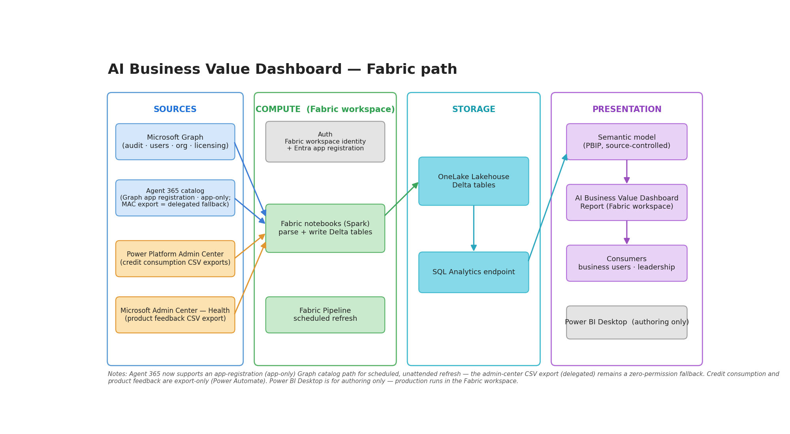

# Fabric / Lakehouse deployment (recommended)

The recommended path. Notebooks pull your Copilot data from Microsoft Graph and write Delta tables
straight into a Lakehouse. The Power BI template is a thin client over the Lakehouse SQL endpoint, so
all the heavy JSON parsing happens in Spark and the dataset stays small and fast.

> **Not only Fabric.** The same notebooks and template also run on **Azure Databricks**, **Synapse
> Spark**, **Azure SQL**, or a **Fabric Warehouse** with no real changes. See
> [Works beyond Fabric](#works-beyond-fabric).

## What's here

| Item | Purpose |
|---|---|
| `AI Business Value Dashboard - Fabric.pbit` | The Power BI template (thin client over a Lakehouse SQL endpoint). |
| `notebooks/` | The base (*No Studio*) ingester notebooks — audit logs, licensed users, org data, plus optional feedback, Agents 365 and Cowork / Work IQ consumption. See [`notebooks/README.md`](notebooks/README.md). |
| `pipelines/`, `flows/`, `docs/` | Optional: a Fabric pipeline to run the core notebooks on a schedule, Power Automate flows for export-only sources, and reference docs. |

> **The base template is *No Studio*.** Copilot Studio agent-transcript analytics and the M365
> work-behaviour comparison are **separate optional add-ons** — see
> [Optional sources](#optional-sources). Everything in this Quick start is the core, Studio-free path.

## 📚 Dashboard pages

14 report pages — activation, adoption, value, maturity, governance, feedback &amp; appendices

| Page | Purpose |
|---|---|
| **◆ Activation** | Activation across teams — licensed vs unlicensed, active vs inactive |
| **🎯 Readiness** | Ranks unlicensed / low-adoption users by upgrade‑priority score |
| **📡 Adoption** | User counts, coverage %, licensed vs unlicensed reach |
| **🪙 Consumption** | Copilot &amp; agent consumption — credits / messages over time |
| **🔮 Activity** | Copilot and agent usage, tasks and behaviour mix |
| **🚀 Value** | Hours saved, dollar‑equivalent assisted value, and the business case |
| **🌱 Maturity** | Progression: Asking → Finding → Consuming → Producing → Delegating |
| **🛡 Agent Health** | Agent resolution, abandonment, escalation and response time |
| **💬 Feedback** | Thumbs up/down sentiment and verbatim feedback themes |
| **📈 Heatmap** | Activity heatmap across the reporting period |
| **🏅 Leaderboard** | Top users, agents, and functions |
| **📘 Appendix: Key Concepts** | Methodology and key‑concept explainers |
| **🧬 Appendix: Signal - Impact Table** | Trace raw signals through to value (audit trail) |
| **📘 Appendix: Glossary** | Metric definitions and research sources |

## Quick start

Three core notebooks land the Delta tables; the template is a thin client over them. At a glance:

1. **Create a Lakehouse** and note its SQL endpoint.
2. **Register an Entra app** with three Graph permissions.
3. **Run the three core notebooks** (audit logs, licensed users, org data).
4. **Connect the template** — set two parameters and **Load**.
5. **Schedule the refresh** to match your notebook cadence.

<b>1. Create a Lakehouse</b>

In a Fabric workspace on a capacity (F2+ or trial): **+ New -> Lakehouse**, name it (e.g.
`<your-lakehouse>`). Note its **SQL endpoint** from Lakehouse settings -
`<workspace-guid>.datawarehouse.fabric.microsoft.com`.

<b>2. Register an Entra app</b>

Create an app registration with these **Microsoft Graph application** permissions (admin consent
required), then note the **Tenant ID**, **Client ID**, and a **Client secret value**:

| Permission | Used by |
|---|---|
| `AuditLogsQuery.Read.All` | Audit log notebook |
| `Reports.Read.All` | Licensed users notebook |
| `User.Read.All` | Org data notebook |
| `CopilotPackages.Read.All`, `Application.Read.All` | *Optional* — Agent 365 catalog notebook (app-registration path, see [Optional sources](#optional-sources)) |

<b>3. Run the three core notebooks</b>

For each core notebook (audit logs, licensed users, org data): **+ New -> Import notebook**, attach it
to your Lakehouse and pin it as default, then paste your three values into the `# === CONFIG ===`
cell and run.

| Notebook | Cadence | Output table |
|---|---|---|
| `Copilot_Audit_Log_Direct_Ingester.ipynb` | Daily (Graph caps audit queries to a 7-day window) | `dbo.copilot_interactions_parsed` |
| `Copilot_Licensed_Users_Direct_Ingester.ipynb` | Weekly / monthly | `dbo.copilot_licensed_users` |
| `Copilot_Org_Data_Direct_Ingester.ipynb` | Weekly | `dbo.copilot_org_data` |

Use each notebook's **Schedule** button, or wire all three into a single Fabric pipeline (see
`pipelines/`).

> For production, read the secret from Key Vault instead of a literal - each CONFIG cell has a
> commented `notebookutils.credentials.getSecret(...)` example.

<b>4. Connect the template</b>

Open `AI Business Value Dashboard - Fabric.pbit` in Power BI Desktop and supply the parameters:

| Parameter | Required? | Value |
|---|---|---|
| **Fabric SQL Endpoint** | Yes | `<workspace-guid>.datawarehouse.fabric.microsoft.com` |
| **Lakehouse Name** | Yes | Your Lakehouse name (e.g. `<your-lakehouse>`) |
| `Enable_Dataverse` | Optional | `Include` to load agent tables (Studio deep-dive), else `Exclude` |
| `Enable_ProductFeedback` | Optional | `Include` to load `user_feedback`, else `Exclude` |
| `Enable_Agent365` | Optional | `Include` to load `agents_365`, else `Exclude` |
| `Enable_CostConsumption` | Optional | `Include` to load `copilot_cost_consumption` (Cowork / Work IQ credits — MAC export), else `Exclude` |
| `Enable_Consumption` | Optional | Leave `Exclude`. Transitional PPAC billing toggle — its notebook, flows and setup guide now ship with the **[Fabric + Copilot Studio](../3.%20Fabric%20Extended/Fabric%20+%20Copilot%20Studio/README.md)** build |

Click **Load**, then **Publish** - ideally to a workspace on the **same Fabric capacity** so Direct
Lake works without cross-capacity overhead.

<b>5. Schedule the refresh</b>

In the Service: dataset **Settings -> Data source credentials** -> sign in to the SQL endpoint, then
enable **Scheduled refresh** on a cadence that matches your notebook schedule.

## Optional sources

Leave every `Enable_*` toggle on `Exclude` and the core dashboard still works - optional tables simply
load empty. To switch one on, set its toggle to `Include` and run the matching notebook:

| Source | Toggle | Notebook |
|---|---|---|
| Cowork / Work IQ consumption (MAC) | `Enable_CostConsumption` | `notebooks/Copilot_Cost_Consumption_Ingester.ipynb` ([setup guide](flows/COST-CONSUMPTION.md)) |
| Product feedback | `Enable_ProductFeedback` | `notebooks/Copilot_ProductFeedback_Ingester.ipynb` |
| Agents 365 | `Enable_Agent365` | `notebooks/Copilot_Agent365_Registry_Ingester.ipynb` (app-registration catalog pull — scheduled/unattended) or `notebooks/Copilot_Agent365_Lander.ipynb` (delegated CSV-export fallback) |

Cowork / Work IQ consumption and product feedback are **export-only** in Microsoft's portals (no API) -
the `flows/` folder has Power Automate flows that auto-land those exports for you. Full detail in
[`docs/OPTIONAL-SOURCES.md`](docs/OPTIONAL-SOURCES.md). The **Power Platform (PPAC) per-agent credit**
export is a Studio-build source — see the
[Fabric + Copilot Studio](../3.%20Fabric%20Extended/Fabric%20+%20Copilot%20Studio/README.md) build.

<b>Copilot Studio agent deep-dive</b> — separate add-on template (click to expand)

Agent-transcript analytics and the Agents 365 registry preview are **not** part of the base *No Studio*
build — they ship as the **[Fabric + Copilot Studio](../3.%20Fabric%20Extended/Fabric%20+%20Copilot%20Studio/README.md)**
template and notebooks. To enable them:

1. Use the **Fabric + Copilot Studio** `.pbit` instead of the base template.
2. Set `Enable_Dataverse` = `Include`.
3. Run `3. Fabric Extended/Fabric + Copilot Studio/notebooks/Copilot_Agent_Transcript_Parser.ipynb`.

Full setup lives in the [Fabric + Copilot Studio README](../3.%20Fabric%20Extended/Fabric%20+%20Copilot%20Studio/README.md).

<b>M365 work-behaviour comparison</b> — preview add-on (click to expand)

The optional *AI vs Manual Work* comparison ships with the preview **[Fabric + M365](../3.%20Fabric%20Extended/Fabric%20+%20M365/README.md)**
build (`notebooks/Copilot_M365_Work_Behavior_Ingester.ipynb`). It's a preview and not required for the core dashboard.

<b>Manual export instructions</b> — for first-time setups or sources without an API (click to expand)

The notebooks above are the recommended path. If you'd rather export the underlying data by hand first
(common for a one-off pilot, or for sources that have no API), use the steps below. Each export
produces a CSV you can drop into the Lakehouse `Files/` area and ingest with the matching notebook.

### Audit logs — Microsoft Purview
- **Portal:** [security.microsoft.com](https://security.microsoft.com) → **Audit**
- **Role:** Audit Reader or Compliance Administrator
- **Activities:** `Copilot Activities – Interacted with Copilot` (required); optionally `Interacted with a Connected AI App` and `Interacted with an AI App` for third-party agent coverage
- **Output:** Set a date range, run the search, **Export → Download all results** (CSV, ~50 columns, one row per interaction)

### Licensed users — Microsoft 365 Admin Center
- **Portal:** [admin.microsoft.com](https://admin.microsoft.com) → **Reports → Usage → Microsoft 365 Copilot → Readiness**
- **Role:** Global Administrator or Reports Reader
- **Pre-step:** turn off "Display concealed user/group/site names" under **Settings → Org Settings → Reports** so user names aren't masked
- **Output:** Scroll to **Copilot Readiness Details**, click `...` → **Export** (CSV with `UserPrincipalName`, `Department`, `Has Copilot license assigned`, `LastActivityDate`)

### Org data — Microsoft Entra
- **Portal:** [entra.microsoft.com](https://entra.microsoft.com) → **Identity → Users → All users**
- **Role:** User Administrator or Global Reader
- **Required columns:** `UserPrincipalName`, `Department`. Recommended: `JobTitle`, `Office`, `City`, `Country`, `Manager`
- **Output:** **Download users** (CSV)

### Agent 365 — Microsoft Admin Center
- **Automated path (preferred):** `notebooks/Copilot_Agent365_Registry_Ingester.ipynb` pulls the catalog directly through the Microsoft Graph app registration (app-only — `CopilotPackages.Read.All` + `Application.Read.All`, admin-consented), so no manual export is needed and it can run scheduled/unattended. The manual export below is the delegated, zero-permission fallback (`notebooks/Copilot_Agent365_Lander.ipynb`).
- **Portal:** [admin.microsoft.com](https://admin.microsoft.com) → **Agents**
- **Role:** Global Administrator or Reports Reader (with AI Admin in a Frontier-enrolled tenant)
- **Output:** **Export** from the Agents Overview (CSV: agent name, ID, availability status, last activity, template, assigned users)

### Cowork / Work IQ consumption — Microsoft 365 Admin Center
The Cowork / Work IQ per-user credit export is **export-only**. Land it in the Lakehouse
`Files/cost_consumption/` folder and ingest it with `notebooks/Copilot_Cost_Consumption_Ingester.ipynb`
— full portal steps and the auto-landing flow are in [`flows/COST-CONSUMPTION.md`](flows/COST-CONSUMPTION.md).

### Credit consumption — Power Platform Admin Center *(Studio build)*
The **per-agent Copilot Studio message credit** export now ships with the **[Fabric + Copilot Studio](../3.%20Fabric%20Extended/Fabric%20+%20Copilot%20Studio/README.md)**
build — its notebook, flows and step-by-step guide live in `3. Fabric Extended/Fabric + Copilot Studio/`
([setup guide](../3.%20Fabric%20Extended/Fabric%20+%20Copilot%20Studio/CREDIT-CONSUMPTION-SETUP.md)).

### Product feedback — Microsoft Admin Center (Health)
- **Portal:** [admin.microsoft.com](https://admin.microsoft.com) → **Health → Product feedback**
- **Role:** Global Administrator or Reports Reader
- **Filters:** Product = **Microsoft 365 Copilot** (and optionally Copilot Studio); date range matching your audit export
- **Privacy:** to see user-level data, ensure "Display concealed user names in all reports" is disabled
- **Output:** **Export data** (CSV: date, UPN, product, feedback type, rating, verbatim comment)

### Copilot Studio agent transcripts — Power Apps / Power Automate
- **Portal:** [make.powerapps.com](https://make.powerapps.com) (one-off) or [make.powerautomate.com](https://make.powerautomate.com) (recurring)
- **Role:** System Administrator, System Customizer, or Environment Maker (Dataverse read on `ConversationTranscript`)
- **One-off:** open the **ConversationTranscript** table → **Data → Export data to Excel**, save as CSV
- **Recurring:** scheduled flow → **Dataverse → List rows** (table `ConversationTranscripts`, filter `createdOn ge [yesterday]`) → **Create file** in OneDrive/SharePoint or send via email; the AIBV email-landing flow in [`flows/`](flows/) can pick it up automatically

### Loading the exports
Drop each CSV into the matching folder under your Lakehouse `Files/` area (e.g. `Files/audit/`,
`Files/cost_consumption/`, `Files/feedback/`). Then run the matching notebook from the table above —
each notebook tolerates missing inputs, so partial coverage is fine for a first pass.

## Works beyond Fabric

Portable to Databricks, Synapse, Azure SQL, or a Fabric Warehouse (click to expand)

The two core artifacts are deliberately portable:

- **The notebooks** are plain Python + PySpark - they call Graph with `requests` and write Delta with
  `df.write.saveAsTable(...)`. They run unchanged on any Spark engine (Fabric, Databricks, Synapse).
- **The template** uses the `Sql.Database()` connector, which works against any SQL endpoint exposing
  those tables - Fabric Lakehouse or Warehouse, Databricks SQL Warehouse, Synapse SQL pool, Azure SQL.

To retarget, change just two things: point the notebooks' `OUTPUT_TABLE` at your database, and set the
template's two parameters (**Fabric SQL Endpoint** = your host, **Lakehouse Name** = your database).
The template only needs the three tables - `copilot_interactions_parsed`, `copilot_licensed_users`,
`copilot_org_data` - to exist in that one database with their expected schema. Already producing parsed
CSVs upstream? The [`../1. SharePoint/`](../1.%20SharePoint/) path consumes them with no Spark step.

## Troubleshooting

Common symptoms and fixes (click to expand)

| Symptom | Fix |
|---|---|
| `401`/`403` from Graph | Confirm the three **application** permissions are admin-consented; regenerate the client secret if expired. The audit notebook needs `AuditLogsQuery.Read.All` specifically (it calls `/security/auditLog/queries`). |
| Audit query never finishes | Purview processes it asynchronously; the notebook polls with backoff. If it times out, narrow `LOOKBACK_DAYS` in the CONFIG cell. |
| `Login failed` / `cannot open database` (Power BI) | The SQL endpoint host or database name is wrong - recheck the Lakehouse settings page. |
| `the key didn't match any rows` | A notebook ran against the wrong Lakehouse - pin your Lakehouse as default and re-run. |
| All users show "Unlicensed" | The licensed-users notebook hasn't run yet, or its report period is too narrow (`REPORT_PERIOD = 'D30'`). |
| Refresh slow (over a minute) | Dataset is in Import mode - put the workspace on a Fabric capacity and convert to **Direct Lake**. |

## Reference

- **Roles & permissions (all sources):** [`docs/PERMISSIONS.md`](docs/PERMISSIONS.md)
- **Table schemas:** [`docs/DATA-DICTIONARY.md`](docs/DATA-DICTIONARY.md)
- **Optional sources in depth:** [`docs/OPTIONAL-SOURCES.md`](docs/OPTIONAL-SOURCES.md)
- **Cowork / Work IQ consumption, step by step:** [`flows/COST-CONSUMPTION.md`](flows/COST-CONSUMPTION.md)
- **PPAC credit consumption (Studio build):** [`Fabric + Copilot Studio/CREDIT-CONSUMPTION-SETUP.md`](../3.%20Fabric%20Extended/Fabric%20+%20Copilot%20Studio/CREDIT-CONSUMPTION-SETUP.md)
- **Audit-log JSON schema:** [Microsoft Learn - CopilotInteraction](https://learn.microsoft.com/en-us/office/office-365-management-api/copilot-schema)
