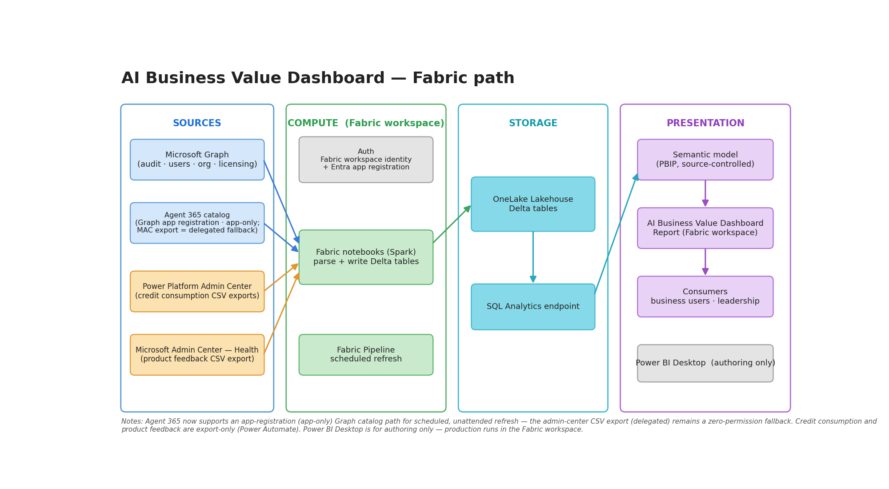

# Fabric / Lakehouse deployment (recommended)

This path ships **two Import-mode Power BI templates** over the same Lakehouse outputs:

- **`ValueLens - Fabric.pbit`** → imports through the **SQL analytics endpoint**
- **`ValueLens - Fabric OneLake.pbit`** → imports the same Delta tables through **OneLake**

Both are **Import**, not Direct Lake.



**Assets:** [`ValueLens_Fabric_Architecture.excalidraw`](ValueLens_Fabric_Architecture.excalidraw) ·
[`ValueLens_Fabric_Architecture.svg`](ValueLens_Fabric_Architecture.svg) ·
[`ValueLens_Fabric_Architecture.png`](ValueLens_Fabric_Architecture.png)

**Jump to:** [Quick start](#quick-start) · [Run order](#run-order-reviewed) ·
[Checker pack](#checker-pack-read-only-tsql) · [Reviewed notebook changes](#reviewed-notebook-changes) ·
[Optional sources](#optional-sources) · [Troubleshooting](#troubleshooting) · [Reference](#reference)

## What's here

| Item | Purpose |
|---|---|
| `ValueLens - Fabric.pbit` | Import template using the Lakehouse SQL analytics endpoint. |
| `ValueLens - Fabric OneLake.pbit` | Import template using the OneLake Tables endpoint over HTTPS/443. |
| `notebooks/` | Core ingesters, `Copilot_Audit_Log_Processor`, and optional-source ingesters. |
| `notebooks/optional/` | Edge-case add-ons outside the core path, each self-contained with its own README. |
| `pipelines/` | Fabric pipeline JSON for the reviewed **core** orchestration plus opt-in branches. |
| `docs/` | Reference notes, including the read-only SQL checker pack. |
| `archive/extended/` | Archived Fabric + Copilot Studio reference, not a recommended active deployment; core notebook mirrors remain synchronized. |
| `archive/flows/` | Archived cost-consumption landing flows and guides, not active setup. |

## Quick start

1. **Create a Lakehouse** and note the SQL analytics endpoint.
2. **Register an Entra app** for the required Graph permissions — see [`docs/PERMISSIONS.md`](docs/PERMISSIONS.md).
3. **Import and run the core notebooks** from [`notebooks/README.md`](notebooks/README.md).
4. **Run the processor** after audit + licensed-user ingestion.
5. **Open one template** (`SQL analytics endpoint` or `OneLake`) and load data.
6. **Publish the configured report/model, then add a success-gated semantic model refresh and schedule the pipeline** — see [`pipelines/README.md`](pipelines/README.md#semantic-model-refresh).

### Connect and refresh

| Template | Required connection parameters |
|---|---|
| SQL | **Fabric SQL Endpoint** (copy the Lakehouse SQL connection server) and **Lakehouse Name** |
| OneLake | **Fabric Workspace ID** and **Lakehouse ID** (lowercase GUIDs from the Lakehouse URL, without surrounding spaces) |

Set **RangeStart** (inclusive) and **RangeEnd** (exclusive) to cover the required history.
Keep **Enable_ProductFeedback** and **Enable_Agent365** set to `Exclude` until their
tables are ready; use `Include` when enabling them. Sign in with an Organizational
Account that can read the source, then load in Desktop.

After publishing, configure the corresponding data-source credentials in Power BI
Service. For OneLake use Organizational Account/OAuth2 at the **Tables-root URL**.
Preserve the packaged [`FabricTable` helper](../scripts/onelake/FabricTable.pq):
its single `AzureStorage.DataLake` source outside the table function supports Service
refresh. Do not replace it with dynamic per-table URL fallbacks. The existing
OneLake refresh and glossary fixes are unchanged by this notebook update.

Run **Refresh now** to check saved credentials, then follow the
[pipeline refresh setup](pipelines/README.md#semantic-model-refresh) to add a native refresh
activity after all model-source branches succeed. The supplied JSON has no refresh activity.
Alternatively, use a later fixed Service refresh schedule; it is **not success-gated**.

## Run order (reviewed)

### Core path

```text
Graph audit ----------------------> Copilot_Audit_Log_Direct_Ingester ----> copilot_interactions_parsed --+
Graph licensed users -------------> Copilot_Licensed_Users_Direct_Ingester -> copilot_licensed_users -----+--> Copilot_Audit_Log_Processor -> copilot_interactions_curated
Graph org users ------------------> Copilot_Org_Data_Direct_Ingester ------> copilot_org_data -------------> semantic model only

After successful notebook / pipeline completion:
Power BI semantic model refresh (add native pipeline activity; not included in shipped JSON)
```

### Optional reviewed branches

```text
Graph Agent 365 registry ---------> Copilot_Agent365_Registry_Ingester ----> agents_365 -----------+
Files/agent365/agents.csv -------> Copilot_Agent365_Lander --------------- > agents_365 -----------+--> processor + model
Files/product_feedback/*.csv ----> Copilot_ProductFeedback_Ingester -------> user_feedback --------> model
```

- **Licence data feeds both the processor and the model.**
- **Org data feeds the model only.**
- **`agents_365` can come from either the registry ingester or the CSV lander, never both.**
- The **shipped pipeline JSON currently wires `EnableAgent365` to the CSV lander**, not the registry ingester.
- **Add Power BI refresh after all model-source branches succeed** using the [native activity](pipelines/README.md#semantic-model-refresh); this repo does **not** ship it inside the pipeline JSON.

## Checker pack (read-only T-SQL)

Use the reviewed checker pack when you want a quick parity / sanity read without editing notebooks:

- [`docs/checker/ValueLens-Fabric-Quick-TSQL-Checks.sql`](docs/checker/ValueLens-Fabric-Quick-TSQL-Checks.sql)
- [`docs/checker/ValueLens-Fabric-Quick-TSQL-Checks.docx`](docs/checker/ValueLens-Fabric-Quick-TSQL-Checks.docx)

Scope:

- **Read-only T-SQL**
- Run in the **Lakehouse SQL analytics endpoint**
- **Not** a Spark SQL notebook
- Reviewed against the current local notebook/model contracts
- **Not live-tested** against your tenant or endpoint

The four queries intentionally use:

- `COUNT_BIG(*)`
- Monday-based weekly grouping
- `CreationDate`-derived week checks for parsed vs curated parity
- separate definitions for **prompt rows**, **distinct prompt messages**, **sessions** (`ThreadId`) and **users**

## Reviewed notebook changes

These notes are based on the current local notebook diffs in `3. Fabric/notebooks/`.

### Audit ingester

- Stable parsed-row keys now include **`Id`**, **`Source_RecordKey`**, **`Source_MessageKey`** and **`Source_ResourceKey`**.
- `MODE` must be **`backfill`** or **`incremental`**.
- **Backfill** writes the parsed table with **`WRITE_MODE='overwrite'`**.
- **Incremental** re-queries the trailing **`LOOKBACK_DAYS = 7`** and writes with **merge-by-Id** semantics.
- Parsed output still derives `InteractionDate`, `WeekStart` and `MonthStart` from `CreationDate`.
- Legacy parsed tables missing the stable key columns fail clearly and require a deliberate fresh backfill before incremental resumes.
- Start that upgrade with a **new, unused staging directory and separate output
  table** to validate coverage. Reusing staging can resume previously completed
  windows instead of fetching them afresh. Backfill to the same output table
  replaces existing parsed data; pause overlapping runs and rerun the processor
  afterward. See [upgrade guidance](docs/INGESTION-STRATEGY.md).

### Audit processor

- Curated output now uses **`MERGE_KEYS = ["Id"]`**.
- First curated rebuild: **`WRITE_MODE="overwrite"`**.
- Ongoing runs after the parsed-table key upgrade: **`WRITE_MODE="merge"`**.
- Merge is rejected if the source keys are missing, blank, or the existing curated table is missing the merge key.

### Snapshot-safety guards

- **Licensed users:** rejects empty, malformed and conflicting duplicate rows.
- **Org data:** rejects malformed `/users` pages, conflicting duplicate identities and manager cycles.
- **Agent 365 registry:** rejects rows without `Title ID` and conflicting duplicate registry rows.
- **Product feedback:** `WRITE_MODE='append'` is explicitly rejected; missing files preserve the existing snapshot unless you deliberately allow an empty first placeholder.
- Feedback discovers exports using OneLake file metadata, not a notebook-local
  filesystem mount. Agent365 aliases are projected without duplicate
  case-insensitive column names.

### Validation boundaries

The updated transformation and Delta-write paths were exercised in Fabric Spark
using synthetic inputs: audit replay/reordering, late-event insertion, processor
overwrite/merge, and licence/org/Agent365/feedback snapshot safeguards. Local
regressions also cover extraction/checkpoint helpers and packaged model contracts.
This does **not** validate tenant Graph permissions, source retention/completeness,
a production backfill, or scheduled Power BI refresh. Validate those in your
deployment before switching production.

### Data check scope

`ValueLens_Data_Check.ipynb` is a **read-only diagnostic**. It shows stored flags, distinct counts and identity overlap. It does **not** independently classify licences or prove historical parity by itself.

## Optional sources

| Source | Notebook | Notes |
|---|---|---|
| Agents 365 registry | `notebooks/Copilot_Agent365_Registry_Ingester.ipynb` | Preferred unattended path when Graph permissions are available. |
| Agents 365 CSV fallback | `notebooks/Copilot_Agent365_Lander.ipynb` | Manual/export fallback. The shipped pipeline invokes this branch. |
| Product feedback | `notebooks/Copilot_ProductFeedback_Ingester.ipynb` | Reads landed files from `Files/product_feedback/`; safe overwrite snapshot only. |
| Cowork / Work IQ consumption | `notebooks/Copilot_Cost_Consumption_Ingester.ipynb` | Optional export-only source; landing flows and guides are [archived reference](archive/flows/COST-CONSUMPTION.md), not active setup. |
| Workday / HRIS org attributes | [`notebooks/optional/workday-org-data/`](notebooks/optional/workday-org-data/README.md) | Edge case. Enriches `copilot_org_data` in place with job family / persona / worker type, joining on work email. Must run **after** `Copilot_Org_Data_Direct_Ingester`, which overwrites that table. |

The former [Copilot Studio add-on](archive/extended/Fabric%20+%20Copilot%20Studio/README.md)
for transcripts and PPAC credit detail is archived reference, not a recommended active deployment.

## Troubleshooting

Start with [`docs/TROUBLESHOOTING.md`](docs/TROUBLESHOOTING.md). The fastest triage path is:

1. Confirm the **three core tables** exist and have rows.
2. Keep optional `Enable_*` toggles off until their source tables are ready.
3. Re-run the **processor** after any parsed-table backfill or licensed-user snapshot change.
4. Refresh the semantic model **after** notebook completion, not on an unrelated fixed timer.

## Reference

- [`notebooks/README.md`](notebooks/README.md)
- [`pipelines/README.md`](pipelines/README.md)
- [`docs/PERMISSIONS.md`](docs/PERMISSIONS.md)
- [`docs/DATA-DICTIONARY.md`](docs/DATA-DICTIONARY.md)
- [`docs/INGESTION-STRATEGY.md`](docs/INGESTION-STRATEGY.md)
- [`docs/TROUBLESHOOTING.md`](docs/TROUBLESHOOTING.md)
- [Archived cost-consumption setup reference](archive/flows/COST-CONSUMPTION-SETUP.md)
- [Archived Fabric + Copilot Studio reference](archive/extended/Fabric%20+%20Copilot%20Studio/README.md)
