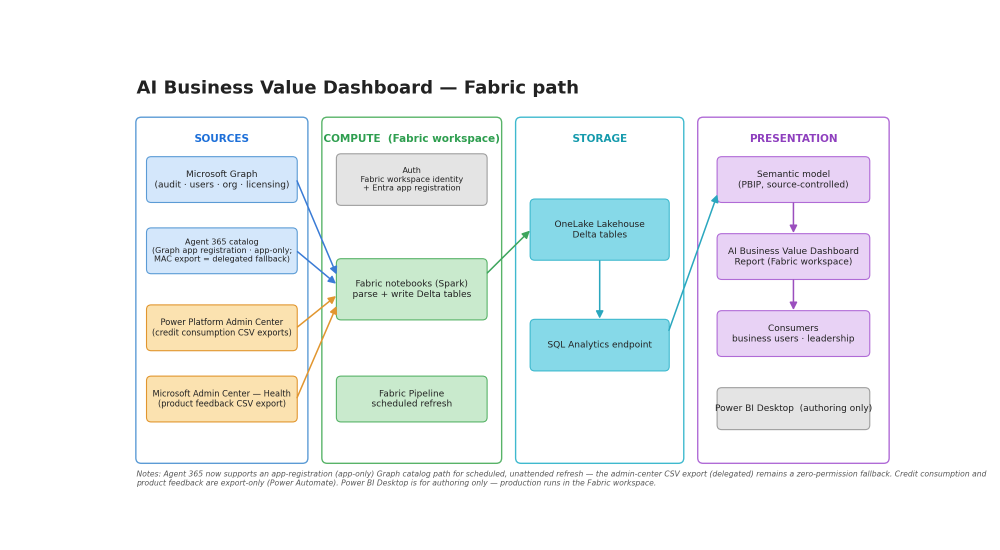

# 3. Fabric — Lakehouse ingestion at scale, on your own capacity

Run **ValueLens** on **Fabric**: PySpark notebooks pull straight from Graph into a Lakehouse, a
processor builds the curated fact table, and a Power BI template imports it. No scripts to
schedule on a box somewhere, no 1 GB file cap, and the optional feedback and Agent 365 sources
plug into the same model.

This path ships **two Import-mode Power BI templates** over the same Lakehouse outputs:

- **`ValueLens - Fabric.pbit`** → imports through the **SQL analytics endpoint**
- **`ValueLens - Fabric OneLake.pbit`** → imports the same Delta tables through **OneLake**

Both are **Import**, not Direct Lake.



**Assets:** [`ValueLens_Fabric_Architecture.excalidraw`](ValueLens_Fabric_Architecture.excalidraw) ·
[`ValueLens_Fabric_Architecture.svg`](ValueLens_Fabric_Architecture.svg) ·
[`ValueLens_Fabric_Architecture.png`](ValueLens_Fabric_Architecture.png)

**Jump to:** [Prerequisites](#-prerequisites) · [Setup](#-setup) ·
[Dashboard pages](#-dashboard-pages) · [Troubleshooting](#-troubleshooting) ·
[Related paths & reference](#-related-paths--reference)

---

## 👤 Who it's for

You have **Fabric capacity** (or Premium / PPU), you want the dashboard refreshing itself at
tenant scale, and you're comfortable running notebooks in a workspace. If you don't have capacity,
[2. SharePoint](../2.%20SharePoint/) gets you scheduled refresh on Power BI Pro instead. If you
just want to see the thing working first, start at [1. Local CSV](../1.%20Local%20CSV/).

### What's here

| Item | Purpose |
|---|---|
| `ValueLens - Fabric.pbit` | Import template using the Lakehouse SQL analytics endpoint. |
| `ValueLens - Fabric OneLake.pbit` | Import template using the OneLake Tables endpoint over HTTPS/443. |
| `notebooks/` | Core ingesters, `Copilot_Audit_Log_Processor`, and optional-source ingesters. |
| `notebooks/optional/` | Edge-case add-ons outside the core path, each self-contained with its own README. |
| `pipelines/` | Fabric pipeline JSON for the reviewed **core** orchestration plus opt-in branches. |
| `docs/` | Fabric-specific reference notes, including the read-only SQL checker pack. Cross-path references (data dictionary, permissions) live in [`/docs`](../docs/). |
| `archive/extended/` | Archived Fabric + Copilot Studio reference, not a recommended active deployment; core notebook mirrors remain synchronized. |
| `archive/flows/` | Archived cost-consumption landing flows and guides, not active setup. |

---

## ✅ Prerequisites

**In Fabric:**
- A workspace on **Fabric capacity** (F2+ or trial), and **Contributor** or **Member** on it.
- A **Lakehouse** in that workspace — note its SQL analytics endpoint, or its workspace/Lakehouse
  GUIDs if you're using the OneLake template.

**In your tenant:**
- One **Entra app registration** with admin-consented **Microsoft Graph application**
  permissions: `AuditLogsQuery.Read.All`, `Reports.Read.All`, `User.Read.All`.
  Optional sources need more — the full least-privilege breakdown is in
  [`/docs/PERMISSIONS.md`](../docs/PERMISSIONS.md).
- Put the client secret in **Azure Key Vault**, not in a notebook.

**On your machine:**
- **Power BI Desktop**, to configure and publish the template.

---

## 🛠 Setup

### Quick start

1. **Create a Lakehouse** and note the SQL analytics endpoint.
2. **Register an Entra app** for the required Graph permissions — see [`/docs/PERMISSIONS.md`](../docs/PERMISSIONS.md).
3. **Import and run the core notebooks** from [`notebooks/README.md`](notebooks/README.md).
4. **Run the processor** after audit + licensed-user ingestion.
5. **Open one template** (`SQL analytics endpoint` or `OneLake`) and load data.
6. **Publish the configured report/model, then add a success-gated semantic model refresh and schedule the pipeline** — see [`pipelines/README.md`](pipelines/README.md#refresh-power-bi-from-the-pipeline).

### Connect and refresh

| Template | Required connection parameters |
|---|---|
| SQL | **Fabric SQL Endpoint** (copy the Lakehouse SQL connection server) and **Lakehouse Name** |
| OneLake | **Fabric Workspace ID** and **Lakehouse ID** (lowercase GUIDs from the Lakehouse URL, without surrounding spaces) |

Set **RangeStart** (inclusive) and **RangeEnd** (exclusive) to cover the required history
(the templates default to 1 Jan 2025 – 1 Jan 2027). **Enable_ProductFeedback** and
**Enable_Agent365** default to `Include`: a table that has not been landed yet loads empty, so
the report still refreshes. Set either to `Exclude` to skip that fetch. Sign in with an
Organizational Account that can read the source, then load in Desktop.

After publishing, configure the corresponding data-source credentials in Power BI
Service. For OneLake use Organizational Account/OAuth2 at the **Tables-root URL**.
Preserve the packaged [`FabricTable` helper](../scripts/onelake/FabricTable.pq):
its single `AzureStorage.DataLake` source outside the table function supports Service
refresh. Do not replace it with dynamic per-table URL fallbacks.

Run **Refresh now** to check saved credentials, then follow the
[pipeline refresh setup](pipelines/README.md#refresh-power-bi-from-the-pipeline) to add a native refresh
activity after all model-source branches succeed. The supplied JSON has no refresh activity.
Alternatively, use a later fixed Service refresh schedule; it is **not success-gated**.

### Run order (reviewed)

#### Core path

```text
Graph audit ----------------------> Copilot_Audit_Log_Direct_Ingester ----> copilot_interactions_parsed --+
Graph licensed users -------------> Copilot_Licensed_Users_Direct_Ingester -> copilot_licensed_users -----+--> Copilot_Audit_Log_Processor -> copilot_interactions_curated
Graph org users ------------------> Copilot_Org_Data_Direct_Ingester ------> copilot_org_data -------------> semantic model only

After successful notebook / pipeline completion:
Power BI semantic model refresh (add native pipeline activity; not included in shipped JSON)
```

#### Optional reviewed branches

```text
Graph Agent 365 registry ---------> Copilot_Agent365_Registry_Ingester ----> agents_365 -----------+
Files/agent365/agents.csv -------> Copilot_Agent365_Lander (if API fails) -> agents_365 -----------+--> processor + model
Files/product_feedback/*.csv ----> Copilot_ProductFeedback_Ingester -------> user_feedback --------> model
```

- **Licence data feeds both the processor and the model.**
- **Org data feeds the model only.**
- **`agents_365` comes from the registry ingester (API) first; the CSV lander runs only if the API step fails.**
- The **shipped pipeline JSON runs `EnableAgent365` as API primary with a CSV fallback**, so tenants without an Agent 365 licence still land the admin-centre export.
- **Add Power BI refresh after all model-source branches succeed** using the [native activity](pipelines/README.md#refresh-power-bi-from-the-pipeline); this repo does **not** ship it inside the pipeline JSON.

### Backfill vs incremental

The audit ingester's `MODE` must be **`backfill`** or **`incremental`**. Backfill **overwrites**
the parsed table; incremental re-queries the trailing **7 days** (`LOOKBACK_DAYS`) and merges by
stable row key. The processor's first curated rebuild uses `WRITE_MODE="overwrite"`; ongoing runs
use `"merge"` on `Id`.

> ⚠️ **Upgrading a parsed table from an older build?** It won't have the stable key columns, so
> incremental fails on purpose and you need a deliberate fresh backfill. Start that upgrade with a
> **new, unused staging directory and a separate output table** to validate coverage. Reusing
> staging can resume previously completed windows instead of fetching them afresh. Backfilling to
> the same output table replaces existing parsed data — pause overlapping runs and rerun the
> processor afterward. Full guidance: [`docs/INGESTION-STRATEGY.md`](docs/INGESTION-STRATEGY.md).

> **Validation boundary.** The reviewed notebook set was exercised in Fabric Spark with synthetic
> inputs plus local regressions. That does **not** validate your tenant's Graph permissions, your
> audit retention or completeness, a production-scale backfill, or scheduled Power BI refresh.
> Validate those in your own deployment before switching production over.

What changed in the reviewed notebook set — write modes, stable keys, snapshot-safety guards — is
recorded in [`CHANGELOG.md`](../CHANGELOG.md).

### Optional sources

| Source | Notebook | Notes |
|---|---|---|
| Agents 365 registry | `notebooks/Copilot_Agent365_Registry_Ingester.ipynb` | **Primary.** Unattended Graph API pull; needs an Agent 365 licence and the Graph permissions. |
| Agents 365 CSV fallback | `notebooks/Copilot_Agent365_Lander.ipynb` | **Fallback.** The shipped pipeline runs it only if the API step fails (e.g. no Agent 365 licence); lands `Files/agent365/agents.csv`. |
| Product feedback | `notebooks/Copilot_ProductFeedback_Ingester.ipynb` | Reads landed files from `Files/product_feedback/`; safe overwrite snapshot only. |
| Cowork / Work IQ consumption | [`archive/notebooks/Copilot_Cost_Consumption_Ingester.ipynb`](archive/notebooks/) | **Archived.** No template reads it since the Credit Meter page was retired; kept with its [landing flows and guides](archive/flows/COST-CONSUMPTION.md) for your own analysis only. |
| Workday / HRIS org attributes | [`notebooks/optional/workday-org-data/`](notebooks/optional/workday-org-data/README.md) | Optional. Adds only missing columns to an existing org snapshot, joining on work email; existing Entra values remain authoritative. Can also land a standalone user-level org table without Entra. For enrichment, run after a fresh Graph org ingestion; for recurring HRIS-only refreshes, use explicit standalone mode. |

The former [Copilot Studio add-on](archive/extended/Fabric%20+%20Copilot%20Studio/README.md)
for transcripts and PPAC credit detail is archived reference, not a recommended active deployment.

### Checker pack (read-only T-SQL)

Use the reviewed checker pack when you want a quick parity / sanity read without editing notebooks:

- [`docs/checker/ValueLens-Fabric-Quick-TSQL-Checks.sql`](docs/checker/ValueLens-Fabric-Quick-TSQL-Checks.sql)
- [`docs/checker/ValueLens-Fabric-Quick-TSQL-Checks.docx`](docs/checker/ValueLens-Fabric-Quick-TSQL-Checks.docx)

Scope:

- **Read-only T-SQL**
- Run in the **Lakehouse SQL analytics endpoint**
- **Not** a Spark SQL notebook
- Reviewed against the current local notebook/model contracts
- **Not live-tested** against your tenant or endpoint

The four queries intentionally use:

- `COUNT_BIG(*)`
- Monday-based weekly grouping
- `CreationDate`-derived week checks for parsed vs curated parity
- separate definitions for **prompt rows**, **distinct prompt messages**, **sessions** (`ThreadId`) and **users**

---

## 📚 Dashboard pages

<details>
<summary>15 report pages — activation, adoption, habits, agents, tasks, value, model and Cowork fit, readiness &amp; appendices</summary>

| Page | Purpose |
|---|---|
| **◆ Activation** | Licensed vs unlicensed, active vs inactive users, across teams |
| **📡 Adoption** | Adoption and reach, and usage trends by tool |
| **🌱 Habit Formation** | How usage matures into habits over time |
| **🛡 Agent Registry** | Agent catalogue, tenant builds and observed use; registry detail needs the optional **Agent 365** source |
| **🔮 Task Breakdown** | What Copilot, agents and Cowork are used for, by task category |
| **🚀 Estimated Value** | Hours saved and assisted value, by task and function |
| **🧠 Model Fit** | Which AI models handle which tasks, and how well each session's model fits the task (High / Medium / Low) |
| **🧭 Cowork Fit** | How well each Cowork task suits Cowork (High / Medium / Low fit), and why |
| **🎯 Cowork Readiness** | Where to roll out Cowork next, from observed signals, ranked by organization, then user |
| **🎯 License Readiness** | Where to roll out Copilot licences next, from observed unlicensed use |
| **💬 User Feedback** | User satisfaction and sentiment; needs the optional feedback export |
| **🏅 Leaderboard** | Usage rankings for users, agents and functions |
| **📈 Trend Heatmap** | Weekly trend of a selected metric |
| **📘 Appendix: Glossary** | Definitions, evidence limits and guidance |
| **🧬 Appendix: Signal - Impact Table** | AI tasks performed → human-time estimate → value, with editable assumptions |

A hidden **⚖ License Allocation** page (expansion candidates and dormancy review) is kept for
drill-through. Every template ships this same report; only the data connection differs.
The Tool pills at the top of each page filter on `Agent Filter` (Copilot, Agents, Cowork);
`Environment` is licensing only (Licensed / Unlicensed).

Core pages use audit interactions, licences and org data. Leave optional toggles at
`Exclude` until their tables are ready. A registry-only `agents_365` export supplies
inventory, **not** observability telemetry; unavailable health fields remain blank.
See the [source contract](../docs/DATA-DICTIONARY.md#optional-tables).

**Consumption boundary:** no template reads cost consumption any more (the Credit Meter
page was retired from every variant). `Copilot_Cost_Consumption_Ingester` is
[archived](archive/notebooks/) with its
[contract](../docs/DATA-DICTIONARY.md#6-copilot_cost_consumption--copilot-credit-usage-mac-cost-management-export),
for your own analysis only. PPAC credit detail and Studio transcript pages remain
archived, not part of this active build.

</details>

---

## 🩺 Troubleshooting

Start with [`docs/TROUBLESHOOTING.md`](docs/TROUBLESHOOTING.md). The fastest triage path is:

1. Confirm the **three core tables** exist and have rows.
2. Keep optional `Enable_*` toggles off until their source tables are ready.
3. Re-run the **processor** after any parsed-table backfill or licensed-user snapshot change.
4. Refresh the semantic model **after** notebook completion, not on an unrelated fixed timer.

`ValueLens_Data_Check.ipynb` is a **read-only diagnostic** — it shows stored flags, distinct counts
and identity overlap. It does not independently classify licences or prove historical parity by itself.

---

## ➡️ Related paths & reference

| Path | When you'd go there instead |
|---|---|
| [1. Local CSV](../1.%20Local%20CSV/) | You want a two-minute look before committing capacity to this. |
| [2. SharePoint](../2.%20SharePoint/) | No Fabric capacity — scheduled refresh on Power BI Pro. |
| [4. Power Automate + Dataverse](../4.%20Power%20Automate%20+%20Dataverse/) | Preview: Dataverse as the core transport for the same dashboard. |

Reference:

- [`notebooks/README.md`](notebooks/README.md)
- [`pipelines/README.md`](pipelines/README.md)
- [`/docs/PERMISSIONS.md`](../docs/PERMISSIONS.md)
- [`/docs/DATA-DICTIONARY.md`](../docs/DATA-DICTIONARY.md)
- [`docs/INGESTION-STRATEGY.md`](docs/INGESTION-STRATEGY.md)
- [`docs/STORAGE-MODES.md`](docs/STORAGE-MODES.md)
- [`docs/INCREMENTAL-REFRESH.md`](docs/INCREMENTAL-REFRESH.md)
- [`docs/OPTIONAL-SOURCES.md`](docs/OPTIONAL-SOURCES.md)
- [`docs/TROUBLESHOOTING.md`](docs/TROUBLESHOOTING.md)
- [`CHANGELOG.md`](../CHANGELOG.md) — what changed in the reviewed notebook set
- [Archived cost-consumption setup reference](archive/flows/COST-CONSUMPTION-SETUP.md)
- [Archived Fabric + Copilot Studio reference](archive/extended/Fabric%20+%20Copilot%20Studio/README.md)
