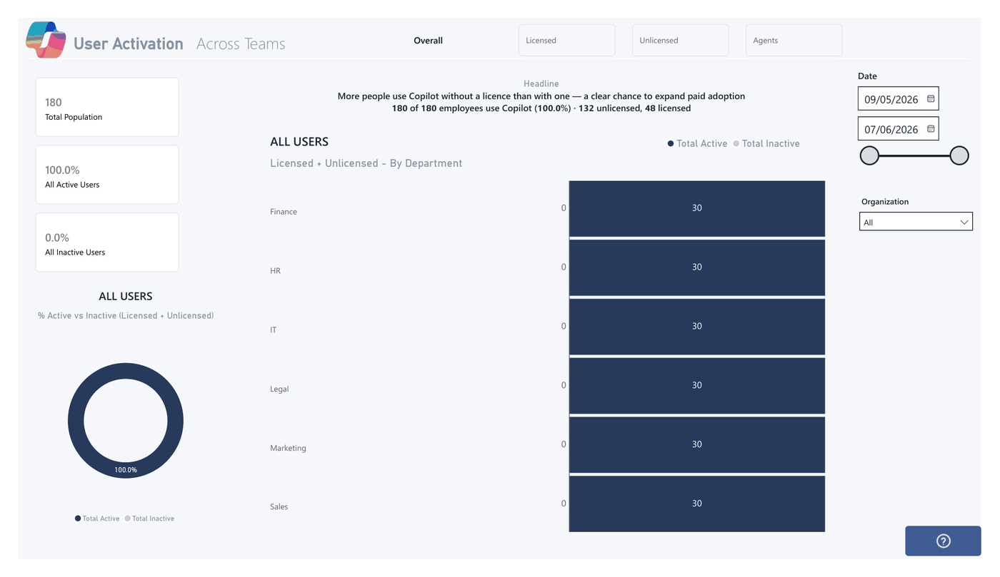

<div align="center">

# 💼 AI Business Value Dashboard

### One Power BI template for every Microsoft **Copilot &amp; agent** adoption signal.

[](https://github.com/Keithland89/AI-Business-Value-Dashboard)
[](#-pick-a-deployment-path)
[](#-pick-a-deployment-path)
[](https://github.com/Keithland89/AI-Business-Value-Dashboard/stargazers)

**Hours saved · assisted value · adoption &amp; readiness** — a defensible ROI narrative aligned to
Microsoft's **Frontier Firm** framework.

Found this useful? ⭐ **Star this repo to help others discover it!**

**[Deployment paths ↓](#-pick-a-deployment-path)** · **[What it measures ↓](#-what-it-measures)** · **[Data sources ↓](#-data-sources)** · **[Dashboard pages ↓](#-dashboard-pages)** · **[Research ↓](#-research-sources)**



</div>

<details>
<summary>⚠️ <strong>Usage & compliance disclaimer</strong></summary>

While this tool helps customers understand the business value of their AI usage data, Microsoft has
**no visibility** into the data customers input, nor control over how the template is used. Customers
are solely responsible for ensuring their use complies with all applicable laws and regulations
(including data privacy and security). **Microsoft disclaims all liability** arising from use of this
template.

This is an **experimental** template with Purview audit logs as the primary source. Audit logs
provide visibility into Copilot/agent interactions but are not intended as the sole source of truth
for licensing or full‑fidelity reporting. Not supported through Microsoft support channels — please
open an issue in this repo.
</details>

---

## 🚀 Pick a deployment path

The dashboard ships as **three folders** — pick the one that matches your setup. They all produce the
same pages and value model; they differ only in *how the data gets in and refreshes*. Prefer a
Dataverse‑native build? That lives in a separate companion repo (called out below the table).

| Path | Pick this when… | What you need |
|---|---|---|
| **[1. SharePoint](1.%20SharePoint/)** · *simplest* | You want the fastest start on **Power BI Pro** — no Fabric or Premium. | Export two CSVs → run one Python step → open the template. Optional: automate the refresh with a scheduled script → SharePoint. The simplest core deployment. |
| **[2. Fabric](2.%20Fabric/)** · *standard · recommended* | You have **Fabric capacity** (or Premium / PPU), or any Spark + SQL stack. | Notebooks shape the data into a Lakehouse → best performance and sub‑second pages, plus the optional billing & feedback pages. The same notebooks + template also run on Databricks, Synapse, or Azure SQL. |
| **[3. Fabric Extended](3.%20Fabric%20Extended/)** · *advanced add‑ons* | You run **Copilot Studio agents** and want the deeper agent / topic / CSAT pages. *(An M365 work‑pattern build is coming soon.)* | Everything in path 2, **plus** the Copilot Studio layer. Stand up path 2 first, then add this. |

**Not sure?** Start with **SharePoint** if you only have Power BI Pro, or **Fabric** if you have
capacity — both run the full core dashboard. Only reach for **Fabric Extended** once you're running
Copilot Studio agents. Landing agent transcripts in **Dataverse**? Use the
[Dataverse companion repo ↗](https://github.com/Keithland89/Copilot-Studio-Agent-Analytics), which reads
them natively — no Fabric or SharePoint needed.

> Each path folder has its **own README** with the exact, step‑by‑step setup. This page is just the
> map.

<details>
<summary>📁 <strong>Repo layout</strong></summary>

```
README.md  ·  LICENSE.md  ·  SECURITY.md  ·  Images/
1. SharePoint/     SharePoint.pbit  ·  SharePoint (Local CSV).pbit  ·  scripts/  ·  azure-container/
2. Fabric/         Fabric.pbit  ·  docs/  ·  flows/  ·  notebooks/  ·  pipelines/
3. Fabric Extended/
     Fabric + Copilot Studio/   deeper agent-transcript, topic/CSAT & PPAC credit build (Studio pages)
     Fabric + M365/             work-pattern build — 🧪 coming soon
archive/           superseded versions — kept for reference, not maintained

Dataverse path → companion repo: Keithland89/Copilot-Studio-Agent-Analytics
```
</details>

---

## 📊 What it measures

- **Quantified value** — hours saved and dollar‑equivalent assisted value, grounded in research‑sourced time baselines.
- **Frontier Firm maturity** — where you sit on the Pattern 1 (human + Copilot) → Pattern 2 (human + agent) → Pattern 3 (agents run workflows) journey.
- **Value by function** — Sales, HR, IT, Legal, Finance, Marketing, Customer Service, with task‑level attribution.
- **User maturity** — Beginner → Developing → Proficient, from behavioural breadth and agent adoption.
- **Business case** — projected annual value, ROI multiple, and licence investment net.

**How:** every interaction → classified into an **AI Task** → mapped to a research‑sourced **time
baseline** → summed to **Hours Saved** → × hourly rate = **Assisted Value**.

---

## 🔌 Data sources

| Source | Required? | Where it comes from |
|---|---|---|
| Copilot interactions (audit logs) | ✅ Core | Microsoft Purview |
| Licensed users | ✅ Core | Microsoft 365 Admin Center |
| Org data (department / function) | ✅ Core | Microsoft Entra |
| Agents 365 | ⬜ Optional | Agent 365 export (Fabric path) |
| Cowork / Work IQ consumption | ⬜ Optional | Microsoft 365 Admin Center export → see [`2. Fabric/flows/COST-CONSUMPTION.md`](2.%20Fabric/flows/COST-CONSUMPTION.md) |
| Credit consumption (billing) | ⬜ Optional | Power Platform Admin Center export → see [`3. Fabric Extended/Fabric + Copilot Studio/CREDIT-CONSUMPTION-SETUP.md`](3.%20Fabric%20Extended/Fabric%20+%20Copilot%20Studio/CREDIT-CONSUMPTION-SETUP.md) *(Studio add-on)* |
| Product feedback | ⬜ Optional | M365 Admin Center → Health → Product Feedback export |
| Copilot Studio agent transcripts | ⬜ Optional | Dataverse `ConversationTranscript` table — use the [Dataverse companion repo ↗](https://github.com/Keithland89/Copilot-Studio-Agent-Analytics) |

Optional sources are gated by `Enable_*` toggles — the dashboard works fine without them. The exact
export + connect steps live in the path README you choose above.

---

## 📚 Dashboard pages

<details>
<summary>15 report pages — adoption, value, maturity, governance, billing & appendices</summary>

| Page | Purpose |
|---|---|
| **User Activation** | Activation across teams — licensed vs unlicensed, active vs inactive |
| **Adoption & Reach** | User counts, coverage %, licensed vs unlicensed |
| **Activity & Value** | Copilot and agent usage, tasks, hours saved and assisted value |
| **Usage Maturity** | Progression: Asking → Finding → Consuming → Producing → Automating |
| **Leaderboards** | Top users, agents, and functions |
| **Agent Governance** | Deployment patterns, creator insights, sensitivity exposure |
| **User Feedback** | Thumbs up/down sentiment and verbatim feedback themes |
| **License Readiness** | Ranks unlicensed users by upgrade‑priority score |
| **Heatmap Trend** | Activity heatmap across the reporting period |
| **Copilot Studio: Credits Consumed** *(Fabric Extended)* | Agent credit consumption and billing breakdown |
| **Copilot Studio: Agent Evaluation** *(Fabric Extended)* | Agent resolution, abandonment, escalation and response time |
| **Copilot Studio: Topic Analysis** *(Fabric Extended)* | Most‑asked topics, resolution and abandonment by agent |
| **Appendix: Key Concepts** | Methodology and key‑concept explainers |
| **Appendix: Glossary** | Metric definitions and research sources |
| **Appendix: Signal Table** | Trace raw signals through to value (audit trail) |

</details>

---

## 🔬 Research sources

<details>
<summary>Published time-baseline sources behind the value model</summary>

Human‑time baselines are drawn from published research — Microsoft Research, MIT/Science (Noy &
Zhang 2023), NBER (Brynjolfsson et al. 2023), BCG/Harvard (Dell'Acqua et al. 2023), McKinsey,
Forrester TEI, IDC, and others. The full per‑task source list is in the **📖 Metric Glossary** page
inside the template.

</details>

---

## 🔒 Security

Please see [SECURITY.md](SECURITY.md) for information on reporting security vulnerabilities.

---

## 🙏 Acknowledgements & licence

Built by the Microsoft Copilot Growth & ROI practice, building on the structure of the community
AI‑in‑One Dashboard. Licensed **MIT** — see [LICENSE.md](LICENSE.md).

---

## Trademarks

This project may contain trademarks or logos for projects, products, or services. Authorized use of Microsoft
trademarks or logos is subject to and must follow
[Microsoft's Trademark & Brand Guidelines](https://www.microsoft.com/en-us/legal/intellectualproperty/trademarks/usage/general).
Use of Microsoft trademarks or logos in modified versions of this project must not cause confusion or imply Microsoft sponsorship.
Any use of third-party trademarks or logos are subject to those third-party's policies.
