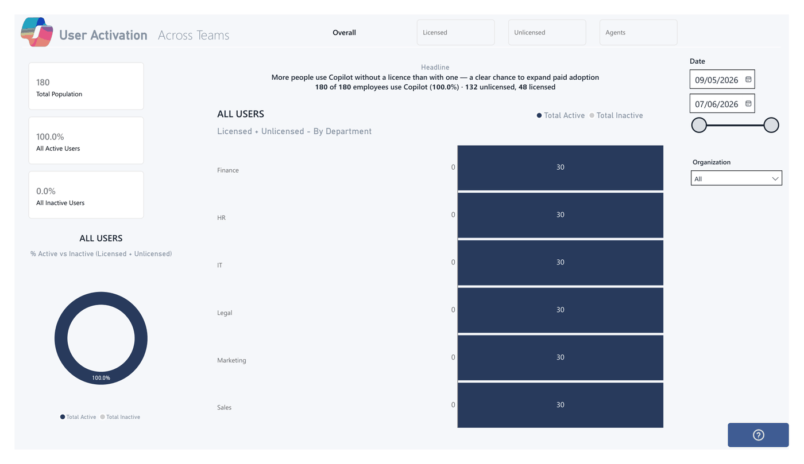

<div align="center">

# 🔎 ValueLens

### *for Microsoft Copilot* — one Power BI template for every **Copilot &amp; agent** adoption signal.

[](https://github.com/Keithland89/ValueLens-for-Microsoft-Copilot)
[](#-pick-a-deployment-path)
[](#-pick-a-deployment-path)
[](https://github.com/Keithland89/ValueLens-for-Microsoft-Copilot/stargazers)

**Hours saved · assisted value · adoption &amp; readiness** — a defensible ROI narrative aligned to
Microsoft's **Frontier Firm** framework.

Found this useful? ⭐ **Star this repo to help others discover it!**

**[Deployment paths ↓](#-pick-a-deployment-path)** · **[What it measures ↓](#-what-it-measures)** · **[Data sources ↓](#-data-sources)** · **[Dashboard pages ↓](#-dashboard-pages)** · **[Research ↓](#-research-sources)**



</div>

## Watch first

Both play here in the page — no download.

**Demo — what the dashboard measures, page by page** *(1m 49s)*

https://github.com/user-attachments/assets/a037e428-f966-4fdf-bf44-7a1d04155a63

**Setup guide — getting your own data in, every source, start to finish** *(7m 07s)*

https://github.com/user-attachments/assets/bc0712c0-e50b-4c8d-91f4-e9aa61e999a1

> ### 👉 New here? Start with **[1. Local CSV](1.%20Local%20CSV/)**
>
> It ships with a **fabricated sample dataset** that fills the whole dashboard. Open the
> template, point it at three CSVs, done — **no tenant, no exports, no setup**. Roughly two
> minutes, and it tells you whether the numbers are worth wiring up before you wire anything up.

<details>
<summary>⚠️ <strong>Usage & compliance disclaimer</strong></summary>

While this tool helps customers understand the business value of their AI usage data, Microsoft has
**no visibility** into the data customers input, nor control over how the template is used. Customers
are solely responsible for ensuring their use complies with all applicable laws and regulations
(including data privacy and security). **Microsoft disclaims all liability** arising from use of this
template.

This is an **experimental** template with Purview audit logs as the primary source. Audit logs
provide visibility into Copilot/agent interactions but are not intended as the sole source of truth
for licensing or full‑fidelity reporting. Not supported through Microsoft support channels — please
open an issue in this repo.
</details>

---

## 🚀 Pick a deployment path

**Same dashboard, a choice of data pathways.** Paths 1–3 remain unchanged. Path 4 is an
additional preview for Power Automate and Dataverse, exercised end-to-end on a bounded demo interval.
Choose based on your available sources, licensing and refresh operating model.

| Path | Pick this when… | Setup |
|---|---|---|
| **[1. Local CSV](1.%20Local%20CSV/)** · *start here* 🧪 | You want to **see it working now** — or run a one-off look at your own numbers. | **Sample data included.** Open the template, point it at three CSVs. No tenant, no exports, no scripts. Then swap in your own export when ready. |
| **[2. SharePoint](2.%20SharePoint/)** · *scheduled, Pro* | You want it **refreshing on its own** on **Power BI Pro** — no Fabric or Premium. | A scheduled script extracts, rolls up and uploads to SharePoint; Power BI refreshes on a timer. |
| **[3. Fabric](3.%20Fabric/)** · *scale · recommended* | You have **Fabric capacity** (or Premium / PPU) and want the reviewed notebook + Lakehouse path. | Two **Import-mode** templates over the same Lakehouse outputs (SQL analytics endpoint or OneLake), plus optional feedback / Agent 365 / consumption sources. |
| **[4. Power Automate + Dataverse](4.%20Power%20Automate%20+%20Dataverse/)** · *preview* | You want a Dataverse-backed pathway using a compatible collector solution as the dashboard's core data source. | Extend a compatible source collector to retain full audit records, combine them with an Entra/licence snapshot using the existing ValueLens processor, and publish a complete Dataverse snapshot. Requires a Python refresh runner as well as Power Automate/Dataverse licensing; not a flow-only deployment. |

**Not sure?** **Start with path 1.** It takes minutes and tells you whether the numbers are worth
automating — *before* you set up any automation. Move to 2 or 3 when you want it hands-off.

> The former **Copilot Studio** agent / topic / CSAT add-on is retained as
> [archived reference](3.%20Fabric/archive/extended/), not a recommended active deployment.
> For agent transcripts in **Dataverse**, use the
> [Dataverse companion repo ↗](https://github.com/Keithland89/Copilot-Studio-Agent-Analytics), which
> reads them natively — no Fabric or SharePoint needed.

> Each path folder has its **own README** with the exact, step‑by‑step setup. This page is just the
> map.

### 🎬 Narrated walkthroughs

Both are at the [top of this page](#watch-first) and play inline.

- **Demo** *(1m 49s)* — a tour of the pages and how the value model fits together.
- **Setup guide** *(7m 07s)* — every data source (Purview audit, Entra, M365 usage), the permissions each needs, the parameters you fill in, and the **Fabric** path in full: PySpark notebooks instead of scripts, the Graph permissions per notebook, the ingester-then-processor run order, and the same notebooks and template running on Databricks, Synapse or Azure SQL.

<details>
<summary>📁 <strong>Repo layout</strong></summary>

```
README.md  ·  LICENSE  ·  Images/

1. Local CSV/      Local CSV.pbit  ·  sample-data/   ← start here, fabricated demo dataset
2. SharePoint/     SharePoint.pbit  ·  scripts/  ·  azure-container/
3. Fabric/         Fabric.pbit  ·  docs/  ·  flows/  ·  notebooks/  ·  pipelines/
     archive/extended/  archived Copilot Studio add-on reference (core notebook mirrors still synchronized)
     archive/flows/     archived cost-consumption flows and guides, not active setup
4. Power Automate + Dataverse/  Power Automate + Dataverse.pbit  ·  scripts/  ·  source-map.json
archive/           superseded versions — kept for reference, not maintained

Dataverse path → companion repo: Keithland89/Copilot-Studio-Agent-Analytics
```
</details>

---

## 📊 What it measures

- **Quantified value** — hours saved and dollar‑equivalent assisted value, grounded in research‑sourced time baselines.
- **Value by function** — Sales, HR, IT, Legal, Finance, Marketing, Customer Service, with task‑level attribution.
- **User maturity** — Beginner → Developing → Power, from usage breadth and agent adoption.
- **Business case** — projected annual value, ROI multiple, and licence investment net.

**How:** every interaction → classified into an **AI Task** → mapped to a research‑sourced **time
baseline** → summed to **Hours Saved** → × hourly rate = **Assisted Value**.

---

## 🔌 Data sources

Availability varies by deployment path. Use the path README for the maintained source list and exact setup.

| Source | Required? | Where it comes from |
|---|---|---|
| Copilot interactions (audit logs) | ✅ Core | Microsoft Purview; path 4 retains full raw payloads in Dataverse before processing |
| Licensed users | ✅ Core | Microsoft 365 Admin Center / Graph; path 4 publishes curated users to Dataverse |
| Org data (department / function) | ✅ Core | Microsoft Entra / BYOD equivalent |
| Agents 365 | ⬜ Optional | Agent 365 export (Fabric path) |
| Cowork / Work IQ consumption | ⬜ Optional | Microsoft 365 Admin Center export → see the path README; [archived landing-flow reference](3.%20Fabric/archive/flows/COST-CONSUMPTION.md), not active setup |
| Credit consumption (billing) | Archived reference only | Power Platform Admin Center export → [archived Fabric + Copilot Studio add-on](3.%20Fabric/archive/extended/) |
| Product feedback | ⬜ Optional | M365 Admin Center → Health → Product Feedback export (Fabric path optional source) |
| Copilot Studio agent transcripts | ⬜ Optional | Dataverse `ConversationTranscript` table — use the [Dataverse companion repo ↗](https://github.com/Keithland89/Copilot-Studio-Agent-Analytics) |

Optional sources are gated by `Enable_*` toggles — the dashboard works fine without them. The exact
export + connect steps live in the path README you choose above.

---

## 📚 Dashboard pages

Maintained page lists live in the path READMEs:

- [`1. Local CSV/README.md`](1.%20Local%20CSV/README.md)
- [`2. SharePoint/README.md`](2.%20SharePoint/README.md)
- [`3. Fabric/README.md`](3.%20Fabric/README.md)
- [`4. Power Automate + Dataverse/README.md`](4.%20Power%20Automate%20+%20Dataverse/README.md)

Archived Studio page reference (not an active deployment):
[`3. Fabric/archive/extended/Fabric + Copilot Studio/README.md`](3.%20Fabric/archive/extended/Fabric%20+%20Copilot%20Studio/README.md).

Across the maintained paths, the common core centres on activation, readiness, adoption,
activity, value, leaderboard, heatmap and appendices. Fabric-specific optional additions
such as feedback are documented in the active Fabric README above; Studio detail is archived.

---

## 🔬 Research sources

<details>
<summary>Published time-baseline sources behind the value model</summary>

Human‑time baselines are drawn from published research — Microsoft Research, MIT/Science (Noy &
Zhang 2023), NBER (Brynjolfsson et al. 2023), BCG/Harvard (Dell'Acqua et al. 2023), McKinsey,
Forrester TEI, IDC, and others. The full per‑task source list is in the **📖 Metric Glossary** page
inside the template.

</details>

---

## 🙏 Acknowledgements & licence

Built by the Microsoft Copilot Growth & ROI practice, building on the structure of the community
AI‑in‑One Dashboard. Licensed **MIT** — see [LICENSE](LICENSE).
