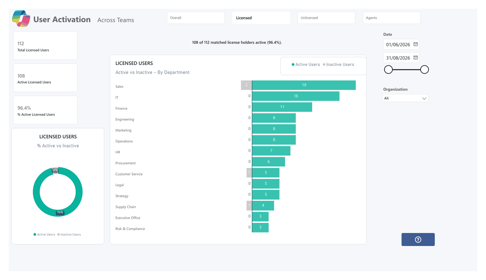

<div align="center">

# 🔎 ValueLens

### *for Microsoft Copilot* — one Power BI template for every **Copilot &amp; agent** adoption signal.

[](https://github.com/microsoft/ValueLens-for-Microsoft-Copilot)
[](#-pick-a-deployment-path)
[](#-pick-a-deployment-path)
[](https://github.com/microsoft/ValueLens-for-Microsoft-Copilot/stargazers)
[](https://github.com/microsoft/ValueLens-for-Microsoft-Copilot/actions/workflows/tests.yml)

**Hours saved · assisted value · adoption &amp; readiness** — a defensible ROI narrative aligned to
Microsoft's **Frontier Firm** framework.

Found this useful? ⭐ **Star this repo to help others discover it!**

**[Deployment paths ↓](#-pick-a-deployment-path)** · **[Repo layout ↓](#-repo-layout)** · **[What it measures ↓](#-what-it-measures)** · **[Data sources ↓](#-data-sources)** · **[Dashboard pages ↓](#-dashboard-pages)** · **[Research ↓](#-research-sources)** · **[Methodology](docs/METHODOLOGY.md)**



</div>

## Watch first

Both play here in the page — no download.

**Demo — what the dashboard measures, page by page** *(1m 49s)*

A tour of the pages and how the value model fits together.

https://github.com/user-attachments/assets/a037e428-f966-4fdf-bf44-7a1d04155a63

**Setup guide — getting your own data in, every source, start to finish** *(7m 07s)*

Every data source (Purview audit, Entra, M365 usage), the permissions each needs, the parameters
you fill in, and the **Fabric** path in full: PySpark notebooks instead of scripts, the Graph
permissions per notebook, the ingester-then-processor run order, and the same notebooks and
template running on Databricks, Synapse or Azure SQL.

https://github.com/user-attachments/assets/bc0712c0-e50b-4c8d-91f4-e9aa61e999a1

> ### 👉 New here? Start with **[4. Local CSV](4.%20Local%20CSV/)**
>
> It ships with a **fabricated sample dataset** that fills the whole dashboard. Open the
> template, point it at the sample CSVs, done — **no tenant, no exports, no setup**. Roughly two
> minutes, and it tells you whether the numbers are worth wiring up before you wire anything up.

<details>
<summary>⚠️ <strong>Usage & compliance disclaimer</strong></summary>

While this tool helps customers understand the business value of their AI usage data, Microsoft has
**no visibility** into the data customers input, nor control over how the template is used. Customers
are solely responsible for ensuring their use complies with all applicable laws and regulations
(including data privacy and security). **Microsoft disclaims all liability** arising from use of this
template.

This is an **experimental** template with Purview audit logs as the primary source. Audit logs
provide visibility into Copilot/agent interactions but are not intended as the sole source of truth
for licensing or full‑fidelity reporting. Not supported through Microsoft support channels — please
open an issue in this repo.
</details>

---

## 🚀 Pick a deployment path

**Same dashboard, a choice of data pathways.** Path 1, Fabric, is the recommended route. It
includes an installer that sets the whole path up for you, and the **Fabric App**: a preview that
runs the dashboard as a web app in your Fabric workspace, on top of the model you publish from any
of paths 1–4. Path 2 is a preview for Power Automate and Dataverse, exercised end-to-end on a
bounded demo interval. Paths 3 and 4 need no Fabric capacity.

**Quick decision:** Fabric capacity → **1** · Dataverse-centric → **2** · Power BI Pro only → **3** ·
no tenant access → **4** · want a web app on top of any of them → **1. Fabric/Fabric App**.

| Path | Licence needed | Refresh | Setup | Scale | Best for |
|---|---|---|---|---|---|
| **[1. Fabric](1.%20Fabric/)** · *recommended* | **Fabric capacity** (F2+ or trial), Premium or PPU | Pipeline-orchestrated, plus a success-gated model refresh | Lakehouse + app registration + notebooks + pipeline | Tenant scale — Lakehouse ingestion, no file caps | High volume, plus the optional feedback and Agent 365 sources |
| **[1. Fabric/Fabric App](1.%20Fabric/Fabric%20App/)** · *preview* | **Fabric capacity** to host the app, plus a published model from paths 1–4 | Live: each page queries the published model as the viewer | `npm install`, point `fabric.yaml` at the model, `npx rayfin up` | As the model beneath it | A fast, shareable app in Fabric instead of a report |
| **[2. Power Automate + Dataverse](2.%20Power%20Automate%20+%20Dataverse/)** · *preview* | Power Automate premium + Dataverse capacity, plus Power BI | Scheduled collector + runner; you advance the snapshot parameter by hand | Collector solution + Dataverse tables + a Python refresh runner | Preview — validated on a bounded demo interval; benchmark before a production cadence | Tenants already collecting Copilot interactions into Dataverse |
| **[3. SharePoint](3.%20SharePoint/)** | Power BI **Pro** | Scheduled, hands-off | App registration + a SharePoint library + a scheduled extract task | Up to Pro's 1 GB model / 2-hour refresh cap | Automatic refresh without Fabric or Premium |
| **[4. Local CSV](4.%20Local%20CSV/)** · *start here* 🧪 | Power BI Desktop only | Manual — re-export, re-run, refresh | **Sample data included.** Open the template, point it at the sample CSVs. ~2 min | One-off; a local file path, so high volumes get slow | Seeing it working now, or a one-off look at your own numbers |

**Not sure?** **Start with path 4.** It takes minutes and tells you whether the numbers are worth
automating — *before* you set up any automation. Move to 3 or 1 when you want it hands-off.

> The former **Copilot Studio** agent / topic / CSAT add-on is retained as
> [archived reference](1.%20Fabric/archive/extended/), not a recommended active deployment.
> For agent transcripts in **Dataverse**, use the
> [Dataverse companion repo ↗](https://github.com/microsoft/AgentEvaluator-for-Copilot-Studio), which
> reads them natively — no Fabric or SharePoint needed.

> 💳 **Want credit consumption and cost too?** Paths 1–4 each have an optional
> **`Add Credit Consumption/`** add-on: the separate **Consumption Central** report for Cowork /
> Work IQ, Copilot Studio, GitHub Copilot and Azure AI Foundry spend. Start with the
> [Local CSV add-on](4.%20Local%20CSV/Add%20Credit%20Consumption/) and its sample data. Once
> it's published, the Fabric App's Consumption page reads it too.

> Each path folder has its **own README** with the exact, step‑by‑step setup. This page is just the
> map.

## 📁 Repo layout

```
README.md  ·  CHANGELOG.md  ·  LICENSE  ·  Images/
CONTRIBUTING.md  ·  CODE_OF_CONDUCT.md  ·  SECURITY.md  ·  SUPPORT.md

docs/              DATA-DICTIONARY.md  ·  PERMISSIONS.md   ← cross-path reference
1. Fabric/         Fabric.pbit  ·  docs/  ·  flows/  ·  notebooks/  ·  pipelines/
     installer/         `npx valuelens-install` — sets up the whole Fabric path for you
     Fabric App/        web app (React + Vite) over a published model  ·  deployed with `npx rayfin up`
     docs/              Fabric-only notes: ingestion, storage modes, troubleshooting, checker pack
     archive/extended/  archived Copilot Studio add-on reference (core notebook mirrors still synchronized)
     archive/flows/     archived cost-consumption flows and guides, not active setup
2. Power Automate + Dataverse/  Power Automate + Dataverse.pbit  ·  scripts/  ·  source-map.json
3. SharePoint/     SharePoint.pbit  ·  scripts/  ·  azure-container/
4. Local CSV/      Local CSV.pbit  ·  sample-data/   ← start here, fabricated demo dataset
*/Add Credit Consumption/  optional Consumption Central cost report, one per path
archive/            superseded versions — kept for reference, not maintained
tests/             offline pytest regressions, run in CI by .github/workflows/tests.yml

Dataverse path → companion repo: microsoft/AgentEvaluator-for-Copilot-Studio
```

---

## 📊 What it measures

- **Quantified value** — hours saved and dollar‑equivalent assisted value, grounded in research‑sourced time baselines.
- **Value by function** — Sales, HR, IT, Legal, Finance, Marketing, Customer Service, with task‑level attribution.
- **Habit formation** — Beginner → Developing → Habitual → Power, from each person's active days in the last complete month.
- **Business case** — projected annual value, ROI multiple, and licence investment net.

**How:** every interaction → classified into an **AI Task** → mapped to a research‑sourced **time
baseline** → summed to **Hours Saved** → × hourly rate = **Assisted Value**. The
[methodology](docs/METHODOLOGY.md) explains every step, page by page.

---

## 🔌 Data sources

Availability varies by deployment path. Use the path README for the maintained source list and exact setup.

| Source | Required? | Where it comes from |
|---|---|---|
| Copilot interactions (audit logs) | ✅ Core | Microsoft Purview; path 2 retains full raw payloads in Dataverse before processing |
| Licensed users | ✅ Core | Microsoft 365 Admin Center / Graph; path 2 publishes curated users to Dataverse |
| Org data (department / function) | ✅ Core | Microsoft Entra / BYOD equivalent |
| Agents 365 | ⬜ Optional | Graph Agent 365 registry — Fabric notebook, or [`Get-Agents365Registry.ps1`](3.%20SharePoint/scripts/Get-Agents365Registry.ps1) on every other path (same 48 columns) |
| Copilot credit consumption & cost | ⬜ Optional, separate report | Cowork / Work IQ, Copilot Studio, GitHub Copilot and Azure AI Foundry → the **Consumption Central** report in each path's `Add Credit Consumption/` folder. Not read by the ValueLens templates |
| Product feedback | ⬜ Optional | M365 Admin Center → Health → Product Feedback export (Fabric table, or the `Feedback File` parameter on the other paths) |
| Copilot Studio agent transcripts | ⬜ Optional | Dataverse `ConversationTranscript` table — use the [Dataverse companion repo ↗](https://github.com/microsoft/AgentEvaluator-for-Copilot-Studio) |

Optional sources can be left out — the dashboard works fine without them. On Fabric, the `Enable_*`
toggles default to `Include` and a table that hasn't been landed loads empty; on the other paths,
leave the `Agent 365` or `Feedback File` parameter blank. The exact export + connect steps live in
the path README you choose above.

---

## 📚 Dashboard pages

Maintained page lists live in the path READMEs:

- [`1. Fabric/README.md`](1.%20Fabric/README.md)
- [`1. Fabric/Fabric App/README.md`](1.%20Fabric/Fabric%20App/README.md)
- [`2. Power Automate + Dataverse/README.md`](2.%20Power%20Automate%20+%20Dataverse/README.md)
- [`3. SharePoint/README.md`](3.%20SharePoint/README.md)
- [`4. Local CSV/README.md`](4.%20Local%20CSV/README.md)

Archived Studio page reference (not an active deployment):
[`1. Fabric/archive/extended/Fabric + Copilot Studio/README.md`](1.%20Fabric/archive/extended/Fabric%20+%20Copilot%20Studio/README.md).

Every path ships the same 15-page report (activation, adoption, habit formation, agent registry,
task breakdown, estimated value, model fit, Cowork fit, Cowork and licence readiness, user
feedback, leaderboard, trend heatmap and two appendices); only the data connection differs.
Studio detail is archived.

---

## 🔬 Research sources

<details>
<summary>Published time-baseline sources behind the value model</summary>

Human‑time baselines are drawn from published research — Microsoft Research, MIT/Science (Noy &
Zhang 2023), NBER (Brynjolfsson et al. 2023), BCG/Harvard (Dell'Acqua et al. 2023), McKinsey,
Forrester TEI, IDC, and others. The full per‑task list, with each band and its source, is in the
[methodology appendix](docs/METHODOLOGY.md#appendix-time-bands-and-sources) and on the
**📖 Metric Glossary** page inside the template.

</details>

---

## 🙏 Acknowledgements & licence

Built by the Microsoft Copilot Growth & ROI practice, building on the structure of the community
AI‑in‑One Dashboard. Licensed **MIT** — see [LICENSE](LICENSE).

---

## 🔗 Project links

| | |
|---|---|
| **Getting help** | [SUPPORT.md](SUPPORT.md) · [open an issue](https://github.com/microsoft/ValueLens-for-Microsoft-Copilot/issues) |
| **Reporting a vulnerability** | [SECURITY.md](SECURITY.md) — please don't use public issues |
| **Contributing** | [CONTRIBUTING.md](CONTRIBUTING.md) · [CODE_OF_CONDUCT.md](CODE_OF_CONDUCT.md) |
| **What changed** | [CHANGELOG.md](CHANGELOG.md) |
| **Reference** | [Methodology](docs/METHODOLOGY.md) · [Data dictionary](docs/DATA-DICTIONARY.md) · [Roles & permissions](docs/PERMISSIONS.md) |

**Running the tests.** The offline regression suite needs only Python 3.12 and `pytest`:

```bash
python -m pip install pytest
python -m pytest tests -q
```

It runs on every pull request via
[`.github/workflows/tests.yml`](.github/workflows/tests.yml). No tenant, credentials or Spark
cluster required — the suite is deliberately offline.
