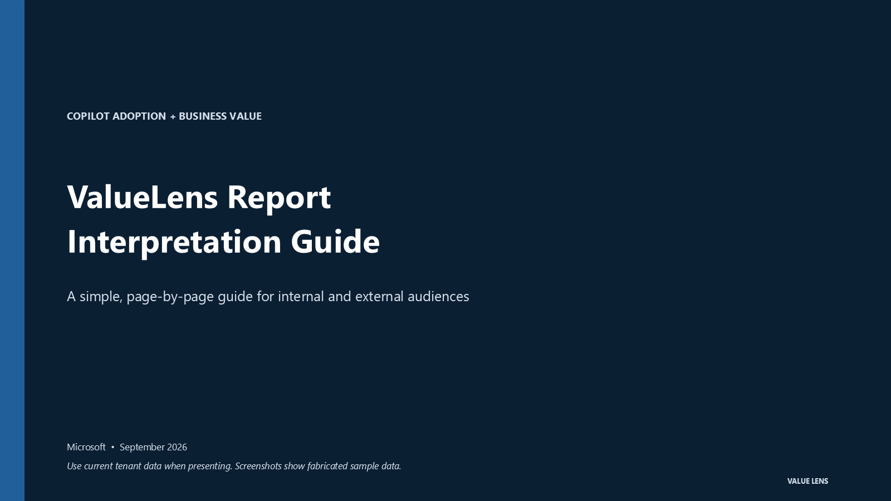

# ValueLens for Microsoft Copilot

A Power BI dashboard that shows how your organisation uses Microsoft 365 Copilot and agents, and
the hours and value they deliver.

## Watch first

**Demo: what the dashboard measures, page by page** *(2m 4s)*

https://github.com/user-attachments/assets/2aa65c5d-2a20-4d51-9f1d-072c712fb4f3

> Prefer to download it? [Get the demo video](media/ValueLens-Demo.mp4).

**Have Fabric?** [Download the Analytics Hub installer](https://github.com/microsoft/ValueLens-for-Microsoft-Copilot/releases/latest/download/AnalyticsHubInstaller.exe),
open it and follow the steps in your browser. Check
[what you need](1.%20Fabric/README.md#before-you-start) first.

**New here?** Read the [📖 Report Interpretation Guide (PDF)](docs/ValueLens-Report-Interpretation-Guide.pdf) — a page-by-page walkthrough of every report page.

## Disclaimer

- **This isn't the official Copilot report.** The official sources are the
  [Microsoft 365 admin center Copilot usage reports](https://learn.microsoft.com/en-us/microsoft-365/admin/activity-reports/microsoft-365-copilot-usage)
  and the [Viva Insights Copilot Dashboard](https://learn.microsoft.com/en-us/viva/insights/org-team-insights/copilot-dashboard).
  ValueLens takes its Copilot figures mainly from the Purview audit log, which isn't the
  authoritative source, so its numbers may not always match those reports exactly.
- **You're responsible for the data once it's extracted.** ValueLens copies data into your own
  Fabric, Azure, Dataverse, SharePoint or CSV files. The retention, deletion and other policies you
  set in Purview, Microsoft 365, Entra ID, Dataverse and the other sources don't apply to those
  copies. Managing that data and meeting your organisation's requirements is up to you.

## Pick a path

Every path gives you the same dashboard. Pick the one that matches what you have, then follow the
steps in its README.

| Path | You need | Setup |
|---|---|---|
| **[1. Fabric](1.%20Fabric/)** (recommended) | Fabric capacity (F2 or larger, or a trial) | Double-click an installer. It sets up everything and deploys the dashboard as an app. **[🎥 Watch the setup](1.%20Fabric/README.md#watch-the-setup)** |
| **[2. Azure](2.%20Azure/)** (preview) | An Azure subscription (Contributor plus User Access Administrator) and Power BI Pro | Run the installer with the Azure target. It deploys Azure SQL, Container Apps jobs and the web app into your subscription, with no Fabric. See [Azure target](1.%20Fabric/installer/README.md#azure-target-preview). |
| **[3. Power Automate + Dataverse](3.%20Power%20Automate%20+%20Dataverse/)** (preview) | Power Automate premium and Dataverse | Import a collector solution and run a refresh script. |
| **[4. SharePoint](4.%20SharePoint/)** | Power BI Pro | App registration, a SharePoint library and a scheduled export. |
| **[5. Local CSV](5.%20Local%20CSV/)** | Power BI Desktop | Open the template. Sample data is included. |

**Just want a look?** Use [5. Local CSV](5.%20Local%20CSV/) with its sample data. It takes two
minutes and needs no access to your tenant.

## Report interpretation guide

A page-by-page guide to reading the ValueLens report — 15 report pages, with the key questions each one answers. Built for both internal teams and external customers.

**[📖 Open the Report Interpretation Guide (PDF)](docs/ValueLens-Report-Interpretation-Guide.pdf)**

## Optional add-ons

- **Credit consumption and cost:** in Fabric, choose it in the installer. Other paths have an
  `Add Credit Consumption` folder.
- **Copilot Studio agent conversations:** in Fabric, choose *Agent Evaluator* in the installer, or
  [set it up by hand](1.%20Fabric/Manual%20setup/Add%20Agent%20Evaluator/).

## Reference

- [How the value is calculated](docs/METHODOLOGY.md)
- [Permissions](docs/PERMISSIONS.md)
- [Data dictionary](docs/DATA-DICTIONARY.md)
- [Report interpretation guide (PDF)](docs/ValueLens-Report-Interpretation-Guide.pdf)
- [What changed](CHANGELOG.md)

Which agents does the audit log cover?

- **Covered by default (Audit Standard):** Microsoft 365 Copilot and its agents, Copilot Studio agents, Security Copilot, Copilot in Fabric, Cowork.
- **Self-hosted pro-code agents** (Agents SDK, Semantic Kernel, LangChain, etc.): only if developers send interactions to Purview (Purview SDK/APIs).
- **Foundry agents:** only when Purview data security is on for the Azure subscription.
- **Third-party AI** (ChatGPT Enterprise, Gemini, Claude): only with Purview pay-as-you-go, logged as `AIAppInteraction`.
- **Consumer Copilot** (personal Microsoft accounts): not logged; outside the tenant.
- **What Analytics Hub reads:** `CopilotInteraction` records only, so `AIAppInteraction` activity isn't included.

Source: [Audit logs for Copilot and AI applications](https://learn.microsoft.com/en-us/purview/audit-copilot)

## Help

[Open an issue](https://github.com/microsoft/ValueLens-for-Microsoft-Copilot/issues) ·
[Support](SUPPORT.md) · [Report a vulnerability](SECURITY.md) · [Contributing](CONTRIBUTING.md) ·
[MIT licence](LICENSE)

Usage and compliance disclaimer

While this tool helps customers understand the business value of their AI usage data, Microsoft has
**no visibility** into the data customers input, nor control over how the template is used. Customers
are solely responsible for ensuring their use complies with all applicable laws and regulations
(including data privacy and security). **Microsoft disclaims all liability** arising from use of this
template.

This is an **experimental** template with Purview audit logs as the primary source. Audit logs
provide visibility into Copilot/agent interactions but are not intended as the sole source of truth
for licensing or full‑fidelity reporting. Not supported through Microsoft support channels — please
open an issue in this repo.

