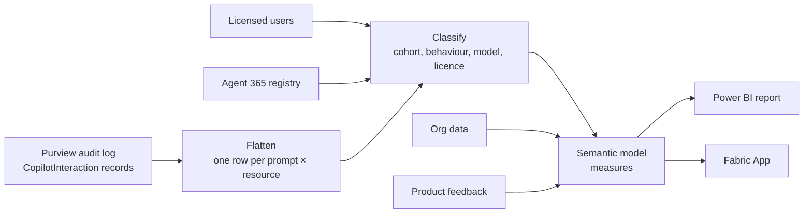
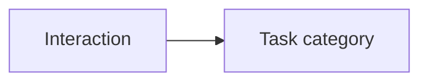

# ValueLens methodology

How ValueLens turns Microsoft Purview audit records into the figures on each page. It covers what
is counted, how each interaction is classified, how value is estimated, and the research behind
the assumptions.

It applies to the Power BI template, where all four data paths share one model, and to the
[Fabric App](../5.%20Fabric%20App/). The app reads the same model and adds two pages of its own
([§8](#8-fabric-app-only-consumption-and-agent-evaluation)). Every rule here is taken from
`3. Fabric/ValueLens - Fabric.pbit` and the `Copilot_Audit_Log_Processor` notebook. If this page
and the model ever disagree, the model is right. The template's **📖 Metric Glossary** page
carries the same caveats inside the report.

**Contents**

1. [What the data can and can't tell you](#1-what-the-data-can-and-cant-tell-you)
2. [From audit record to dashboard row](#2-from-audit-record-to-dashboard-row)
3. [How each interaction is classified](#3-how-each-interaction-is-classified), including
   [from signal to task category](#32-from-signal-to-task-category)
4. [Counting units](#4-counting-units)
5. [Estimated value](#5-estimated-value)
6. [Page by page](#6-page-by-page)
7. [Settings you can change](#7-settings-you-can-change)
8. [Fabric App only: Consumption and Agent Evaluation](#8-fabric-app-only-consumption-and-agent-evaluation)
9. [Known limits](#9-known-limits)
10. [Appendix: time bands and sources](#appendix-time-bands-and-sources)

---

## 1. What the data can and can't tell you

Each Copilot audit record says who used Copilot, when, and in which app. It also lists the
resources the interaction touched (files, emails, meetings, web searches, messages), the plugin
it called and, on some surfaces, the model. It does **not** hold the prompt text, the answer,
whether the answer was used, or how long the work would otherwise have taken.

So every figure falls into one of three tiers. Read each tier differently.

| Tier | Examples | How far to trust it |
|---|---|---|
| **Observed** | Active users, active days, sessions, prompts | Exact counts of what the audit log holds |
| **Inferred** | Behaviour, task category, model fit | Fixed, explainable rules over metadata. Right in aggregate, but they can misread any single interaction. They won't match the AI-inferred categories in Copilot Analytics |
| **Modelled** | Hours, value, ROI | Research-based minutes × observed counts. A scenario, not a measurement |

Absence of evidence is not evidence of absence. An agent with no matched activity may still be
used under another name, and a person with no records may use Copilot on a surface the audit log
doesn't cover.

---

## 2. From audit record to dashboard row



| Step | What happens |
|---|---|
| **1. Collect** | On Fabric, `Copilot_Audit_Log_Direct_Ingester` calls the Microsoft Graph audit log query API (`security/auditLog/queries`) for `copilotInteraction` records each week. The other paths export the same records; see each path's README. |
| **2. Flatten** | Each record carries a list of messages and a list of accessed resources. Responses are dropped. Each prompt is paired with every resource the interaction accessed, so there is **one row per prompt × resource**; a prompt with no resources keeps one row. On the reference data that averages 2.65 rows per prompt. |
| **3. De-duplicate** | Each row's ID is a SHA-256 hash of its record, message and resource keys. Duplicate IDs are dropped, so re-running a week never double-counts. |
| **4. Date** | `InteractionDate`, `WeekStart` (Monday) and `MonthStart`, all from the record's UTC timestamp. |
| **5. Licence** | The user ID is lower-cased and trimmed, then matched to the licensed-users table. `Has license` of YES, TRUE, Y or 1 gives **M365 Copilot Licensed**; anything else, including no match, gives **Unlicensed**. |
| **6. Link agents** | Each agent row is linked to the Agent 365 registry by Entra app ID, then Title ID, then normalised name. The first match wins. |
| **7. Classify** | The rules in [§3](#3-how-each-interaction-is-classified). On Fabric the `Copilot_Audit_Log_Processor` notebook runs them in Spark and writes `copilot_interactions_curated`. The other paths run [`Purview_CopilotInteraction_Processor_v4.0.0.py`](../1.%20Local%20CSV/scripts/Purview_CopilotInteraction_Processor_v4.0.0.py), which classifies agents less finely ([§3.2](#paths-1-2-and-4)). |
| **8. Model** | The model reads the curated rows without reclassifying them. It joins org data (organisation, department, location) on the normalised person ID, and computes the measures. On Fabric, refresh is incremental by `CreationDate`. |

Table and column contracts are in the [data dictionary](DATA-DICTIONARY.md).

---

## 3. How each interaction is classified

### 3.1 Cohort

Every row falls into exactly one activity cohort (`Agent Filter (Normalized)`). Licence status
is a separate dimension, so you can combine the two, for example "Unlicensed × Agents".

| Cohort | Rule, checked in this order |
|---|---|
| **Cowork** | The app host contains "cowork" |
| **Agents** | An agent name or agent ID is present, or the host is autonomous or a Logic App, or the resource is a flow or connector |
| **Copilot** | Everything else: Copilot Chat and Copilot in the Microsoft 365 apps |

### 3.2 From signal to task category



Fixed rules map each interaction to one of 12 task categories, from what it touched (an email, a
spreadsheet, a web search), the action, the app, and for agents the agent's name and description.
The detailed rules are in the `Copilot_Audit_Log_Processor` notebook. Cowork prompts are
categorised separately; that method is being revised and isn't documented here yet.

| Task category | Example |
|---|---|
| **Email** | Drafting a reply in Outlook |
| **Meetings** | Preparing for a Teams meeting |
| **Document Creation** | Drafting a Word document |
| **Document Summarisation** | Summarising a PDF |
| **Presentations** | Building a PowerPoint deck |
| **Data & Analysis** | Reviewing a spreadsheet |
| **Search & Research** | Searching the web or the intranet |
| **Coding & Technical** | Writing or reviewing code |
| **Creative & Design** | Generating an image |
| **Collaboration & Workflows** | Messaging in Teams, or an agent running a workflow |
| **Specialist Support** | A coaching or service desk agent |
| **General Chat & Q&A** | General questions with nothing attached |

#### Paths 1, 2 and 4

These paths classify with
[`Purview_CopilotInteraction_Processor_v4.0.0.py`](../1.%20Local%20CSV/scripts/Purview_CopilotInteraction_Processor_v4.0.0.py).
It has no Agent 365 registry and doesn't split workflows, so more agent activity lands in General
Chat & Q&A or Collaboration & Workflows.

### 3.3 Other derived columns

| Column | Rule |
|---|---|
| **Usage mode** | A ladder, highest first. **5 Delegating**: autonomous runs, workflows, and autonomous, workflow or triggered agents. **4 Producing**: drafting, creating, coding and specialist agents. **3 Consuming**: summarising, meeting prep and media analysis. **2 Finding**: search and retrieval. **1 Asking**: everything else |
| **Value outcome** | Set per behaviour by the processor, for example Time Saved (Email) or Search Time Saved |
| **Expertise role** | The specialist a behaviour stands in for, for example Data Querying → Data Analyst |
| **Grounding source** | Web (a Bing or web plugin), Internal (resources or context), Mixed, or Ungrounded |
| **AI model** | The logged model name, bucketed into GPT-4, GPT-4.1, GPT-5, o-series, Claude, Gemini, LLaMA and Phi. No model logged gives "Embedded App (no model logged)" |
| **Workflow action** | For workflow rows, the verb: sending, creating, invoking, updating, reading or deleting |
| **Plausible behaviour** | For unlicensed users, behaviours that need licensed Copilot are relabelled "Free Chat Workaround (pasting …)": the content was pasted into free Copilot Chat |

---

## 4. Counting units

| Unit | Definition | Note |
|---|---|---|
| **AI task** | A prompt row | A proxy, not a finished output. Because rows are prompt × resource, one prompt that reads three files counts as three tasks |
| **Prompt** | A distinct message ID flagged as a prompt | |
| **Session** | A distinct user + app + thread, where the prompt row has all three plus a message ID | "Microsoft Teams" and "Teams" count as one app |
| **Active user** | A named user with at least one AI task in the selection | |
| **Active day** | A distinct UTC date with at least one prompt | |
| **Per week** | Totals ÷ the weeks in the selected dates that hold any activity | Sessions per user per week averages each week's sessions ÷ that week's active users |

---

## 5. Estimated value

### 5.1 The chain

```
Hours   = Copilot and Agent hours (behaviour basis) + Cowork hours
Value   = Hours × hourly rate × penalty factor (1)
Cost    = Σ months (active licensed users that month × price per user per month)
Net ROI = Value − Cost
Annual  = Value × 52 ÷ weeks in view
```

Cowork hours are priced on their own basis. That method is being revised and isn't documented here
yet.

There are no hidden haircuts. Earlier versions cut value by 70% for realisation and 50% for
reinvestment. Neither cut had a source, so both were removed. Uncertainty is carried by the
**effort scenario** instead. *Conservative* uses the low end of each researched band, *Typical*
the midpoint and *Optimistic* the high end.

> **Cost counts active seats only.** It prices licensed people who used Copilot in each month,
> not every seat. Idle seats are priced separately on License Readiness, from the Monthly Licence
> Cost setting.

### 5.2 Copilot and agents: behaviour basis

For each behaviour:

```
hours = units × minutes (Low / Typical / High) × category adjustment ÷ 60
```

- **Minutes** come from the `Human Time Estimates` table: one researched band per behaviour, listed
  in the [appendix](#appendix-time-bands-and-sources).
- **Units** depend on the behaviour's grain:
  - **Per turn** (most behaviours): distinct prompts. Each band already assumes a typical number of
    steps, so counting every resource row would apply that assumption twice.
  - **Per resource** (search, file retrieval, PDF, data querying, meeting prep, people lookup,
    image and code analysis, multi-source synthesis): each resource is a document someone would
    really have had to open. The prompt count is scaled by how many resources this selection
    reads per prompt, compared with the estate-wide average for that behaviour.
- **Category adjustment** is a multiplier that defaults to 1. It is set in five groups: Comms,
  Meetings, Content, Search and Agents ([§7](#7-settings-you-can-change)).

---

## 6. Page by page

The Fabric App gathers the report's pages into seven of its nine pages:

| App page | Report pages it holds |
|---|---|
| Adoption | Activation, Adoption, Habit Formation, Trend Heatmap |
| Leaderboards | Leaderboard, Agent Registry |
| Readiness | License Readiness, License Allocation, Cowork Readiness |
| Value | Task Breakdown, Estimated Value |
| Efficiency | Cowork Fit, Model Fit |
| Feedback | User Feedback |
| Appendix | Glossary, Signal → Impact |
| Consumption, Agent Evaluation | App only ([§8](#8-fabric-app-only-consumption-and-agent-evaluation)) |

### Activation: who has started?

- **Licensed:** active licensed users ÷ licensed users. Licensed users are the licence table's
  people, matched to org data so the organisation filters apply.
- **Unlicensed:** active unlicensed users ÷ (org population − licensed users).
- **Agents:** active users who used an agent ÷ all active users.
- **Inventory guard.** Composition figures show only when the licence inventory reconciles: it
  isn't empty, and it holds at least as many people as are seen using a licence. Otherwise they
  are left blank rather than shown as zero.

### Adoption: who keeps coming back?

For each cohort (all, licensed, unlicensed, agents, Cowork): active users, sessions, sessions per
user per week, expert-equivalent hours per week, and the top value outcome.

- **Agent return rate:** people with two or more agent sessions ÷ people with at least one.
- **Top value outcome** ranks outcomes by hours.

### Habit Formation: has it become a habit?

Each person's active days in the **last complete calendar month** place them in one stage:

| Stage | Active days | Roughly |
|---|---|---|
| Power | 16 or more | Nearly every working day |
| Habitual | 11–15 | About three days a week |
| Developing | 6–10 | One or two days a week |
| Beginner | 1–5 | Now and then |
| Inactive | 0 | Licensed, but no recorded use |

- If the data ends on a month-end, that month counts as complete. Otherwise the previous month is
  used, so a part month never pushes people down a stage.
- Inactive needs a seat, so it is blank in the Cowork cohort, which has no seat inventory.
- The trend repeats the rule for each complete month.
- **These cut-offs are an inherited working mapping, not a validated benchmark.** No external
  study is behind them. Use them to compare groups and track movement, not as absolute targets.

### Trend Heatmap: where is momentum?

One metric at a time (active users, active days per user, expert hours per user, or sessions per
user) by organisation over time.

### Leaderboard: who and what is doing the most?

- **People** are ranked by sessions within their organisation, per cohort. Security Copilot's
  automated sessions are excluded, because they would top every list.
- **Agents** are ranked by users and sessions, with their registry descriptions.

### Agent Registry: what agents exist, and are they used?

Comes from the optional Agent 365 registry. Each agent gets two labels.

**Lifecycle.** The first rule that fits wins:

1. Blocked by admin
2. In use (at least one matched user)
3. Deployed, not yet used
4. Tenant-built, no owner
5. Tenant-built, not deployed
6. Catalogue listing

**Usage review.** Idle time is counted from the agent's last activity to the newest audit date.
The first rule that fits wins:

1. No usage recorded
2. Dormant (idle 90+ days)
3. Cooling (idle 30+ days)
4. High impact (50+ users)
5. Established (15+)
6. Growing (5+)
7. Pilot

Agents with the same name are de-duplicated to the copy with the most users. Usage is matched by
ID first and name last ([§2](#2-from-audit-record-to-dashboard-row), step 6), so a renamed agent
can appear unused.

### Task Breakdown: what was the work?

AI tasks and their share of all activity in the selection, by behaviour
([§3.2](#32-from-signal-to-task-category)), workflow action and value outcome
([§3.3](#33-other-derived-columns)).

### Estimated Value: what was it worth?

Hours, value, cost, net ROI and projected annual value, by task category
([§3.2](#32-from-signal-to-task-category)) and by organisation ([§5](#5-estimated-value)). The effort scenario and hourly rate are set on the page.

### Cowork Fit and Cowork Readiness

These pages grade Cowork sessions and score who is ready for Cowork. Their method is being revised
and isn't documented here yet.

### Model Fit: was the model heavier than the task?

| Logged model | Cost tier |
|---|---|
| Opus, GPT-6 | Frontier (premium cost) |
| Sonnet, other Claude, GPT-5, GPT-4 | Workhorse (mid cost) |
| None logged | Not attributed |

A session takes the most premium tier it used. Sessions with a Cowork Fit grade and a known tier
are **judged**:

- **Lighter model may do:** a Frontier model on a session graded Worth a look.
- **Try stronger:** a Workhorse model on a session graded Strong fit.
- **Good match:** everything else.

The verdict is the most common outcome. It is greyed out below five judged sessions. The feed
carries no token counts, so this compares tiers, not actual spend.

### License Readiness: who should get a licence next?

Scores unlicensed people who are already using free Copilot Chat. Full marks come at 30 tasks a
week (about six a working day) and five active days a week:

```
score = 60 × min(median tasks per active week ÷ 30, 1) + 40 × min(median active days per active week ÷ 5, 1)
```

| Score | Tier |
|---|---|
| 70 or more | Ready Now |
| 50–69 | Strong Candidate |
| 30–49 | Watch |
| Under 30 | Not Ready |

- A confidence flag reflects how many weeks of data sit behind each score. People with no
  unlicensed activity have no score, rather than a zero.
- **Dormant seats** are licensed people inactive for 30 days or more before the newest audit date.
  Their reclaim value is dormant seats × Monthly Licence Cost, which defaults to 0 (not costed).
- **License Allocation** ranks organisations by unlicensed sessions per person per week, then by
  active unlicensed users.

### User Feedback: what do people say?

From the optional Product Feedback export.

- **Satisfaction:** thumbs up ÷ all feedback items.
- **Category:** keyword rules over the prompt and comment text, where the first match wins. For
  example, "hallucin" or "wrong answer" gives AI Accuracy, and "slow" or "timeout" gives
  Performance & Errors. Short or empty text is Uncategorized.
- **Surface:** the agent name if present, otherwise the app.

---

## 7. Settings you can change

| Setting | Default | Where | Effect |
|---|---|---|---|
| Effort scenario | Typical | Estimated Value slicer; app Value page | Picks the Low, Typical or High band |
| Hourly value | 50 in the app; the report's slicer, where value is blank until you pick one | Estimated Value; app Value page | Hours → money |
| Adj Comms / Meetings / Content / Search / Agents | 1 | `Assumptions` table | Scales the minutes for that group of behaviours |
| Penalty factor | 1 | `Assumptions` table | Optional extra multiplier on value |
| AI PPUPM | 30 | `Assumptions` table | Licence price per user per month, for cost and ROI |
| Monthly Licence Cost | 0 | `Assumptions` table | Prices dormant seats; 0 means not costed |
| Currency symbol | £ | `Assumptions` table | Display only; it doesn't convert. Enter money settings in this currency |
| Rates & packs | From `commercial_terms` | App Consumption page | Credit prices ([§8](#81-consumption)) |

---

## 8. Fabric App only: Consumption and Agent Evaluation

These two pages read optional models, not ValueLens. Each appears only when its model is
connected in `fabric.yaml`.

### 8.1 Consumption

Reads a published [Consumption Central](../3.%20Fabric/Add%20Credit%20Consumption/) model and
rebuilds its consumption and cost pages.

| Section | Source | How cost is worked out |
|---|---|---|
| **Cowork / Work IQ** | Weekly credits per person from Viva Insights (`viva_credits_weekly`) | Credits up to the Capacity Pack balance are priced at the **prepaid rate**; the rest at the **pay-as-you-go rate**. The pack applies to the credits in the selected period. Week by week it is used up in date order, so later weeks spill into pay-as-you-go first. Blended rate = cost ÷ credits |
| **Copilot Studio** | Power Platform admin centre exports: tenant by day, plus agent and user views | The tenant export already splits prepaid from pay-as-you-go credits, and each is priced at its rate. Effective rate = cost ÷ credits. Per-agent and per-user cost uses the pay-as-you-go rate |
| **Azure** | Azure Cost Management export for the whole solution, or Azure AI Foundry spend by model | Actual billed cost, in the export's own currency. The rates don't apply. If neither export is loaded, the section says which to load and the other sections still work |

**Rates & packs.** By default the rates come from the model, through the `commercial_terms` table
or the model's parameters. In the app, **Rates & packs** overrides them for everyone. The values
are stored in the app's SQL database. Each query redefines the model's rate measures with them,
so the published model and the Power BI report keep their own rates. Rates must be between $0.001
and $0.05 per credit. A pack balance of 0 means no pack.

### 8.2 Agent Evaluation

Reads a published [Agent Evaluator](https://github.com/microsoft/AgentEvaluator-for-Copilot-Studio)
model. That model is built from Copilot Studio conversation transcripts in Dataverse. The app shows
aggregates and feedback comments only. It never shows the conversations.

| Measure | Definition |
|---|---|
| Resolution rate | Conversations the agent resolved itself ÷ all conversations. The model's verdict uses 70% as its working benchmark |
| Implied success | Conversations the orchestrator flagged as implied success. A proxy for satisfaction when thumbs are sparse |
| Unintended escalation | Error-driven handoffs ÷ all conversations. Designed or requested handoffs are excluded |
| True failure rate | Failing conversations (an error forced a handoff, or an engaged user gave up) ÷ conversations that actually started |
| Error rate | Sessions with at least one error trace |
| Response time | Median seconds, plus the share of replies over 10 seconds, the point where people start to disengage |
| CSAT | Thumbs up ÷ (up + down), counted per turn |
| Grounded rate | Sessions answered from an internal knowledge source |
| Knowledge gap rate | Of the times the agent searched, how often it found nothing usable |
| Friction | A 0–100 score where higher is worse: 60% give-up rate, 40% turns taken |
| Answer archetype | The most advanced thing the agent did: answered from your content, answered from the model alone, passed to a specialist, or hit an error |

---

## 9. Known limits

- **Licence status isn't dated.** It comes from the licensed-users snapshot at processing time,
  not from the day of the interaction. Someone licensed last month can show as licensed for
  earlier months too, and the reverse.
- **Tasks are rows, not prompts.** Use prompts or sessions when you need a per-interaction count.
- **Categories are rule-based.** They are deterministic and explainable, but they won't match
  Copilot Analytics' AI-inferred categories, and agent categories are only as good as agent names
  and descriptions. Paths 1, 2 and 4 don't read the agent registry or split workflows
  ([§3.2](#paths-1-2-and-4)).
- **Some time bands are provisional.** Rows marked *Low* confidence or *Provisional* in the
  appendix are estimates waiting for a better source.
- **Habit and readiness thresholds are design choices**, not research results.
- **Model fit has no cost data.** It compares tiers, many surfaces log no model, and tiers are
  matched on the model name.
- **Dates are UTC.** Days and weeks can shift by one for people far from UTC.
- **Feedback categories use English keywords.** Other languages mostly land in General.

---

## Appendix: time bands and sources

Minutes per unit of work, from the `Human Time Estimates` table. Typical is the default. The table
also keeps a single `Human Baseline (min)` column from the earlier method; no measure uses it.

| Behaviour | Low | Typical | High | Grain | Confidence | Source |
|---|---:|---:|---:|---|---|---|
| Email Triage | 4 | 10 | 12 | Turn | Medium-High | [Microsoft Research (Iqbal & Horvitz 2007)](https://www.microsoft.com/en-us/research/publication/disruption-and-recovery-of-computing-tasks-field-study-analysis-and-directions/); McKinsey 2023 |
| Email Thread Summary | 2 | 5 | 9 | Turn | Medium | [Nielsen Norman Group 2023](https://www.nngroup.com/articles/); Microsoft WTI 2024 |
| Email Summarising | 2 | 4 | 7 | Turn | Medium | Dabbish & Kraut (CMU 2006); [Mark et al. 2012](https://www.ics.uci.edu/~gmark/Home_page/Welcome.html) |
| Email Drafting | 3 | 8 | 12 | Turn | High | McKinsey 2023; [Brynjolfsson et al. (NBER 2023)](https://www.nber.org/papers/w31161) |
| Teams Messaging | 4 | 8 | 11 | Turn | Medium | [Microsoft WTI 2023](https://www.microsoft.com/en-us/worklab/work-trend-index); Grammarly 2023 |
| Meeting Scheduling | 5 | 12 | 17 | Turn | High | [Doodle 2019](https://meetings.doodle.com/the-state-of-meetings-report-2019); HBR 2017 |
| Meeting Prep | 6 | 15 | 22 | Resource | High | Forrester TEI 2024; [HBR (Rogelberg 2019)](https://hbr.org/2019/01/why-your-meetings-stink-and-what-to-do-about-it) |
| Video Summarising | 12 | 30 | 44 | Turn | Medium-High | [Microsoft WTI 2024](https://www.microsoft.com/en-us/worklab/work-trend-index); Kaltura 2023 |
| Document Drafting | 21 | 42 | 42 | Turn | High | [Noy & Zhang (Science 2023)](https://www.science.org/doi/10.1126/science.adh2586); BCG/Harvard 2023 |
| Document Summarising | 10 | 20 | 35 | Turn | Medium-High | [BCG/Harvard (Dell'Acqua et al. 2023)](https://www.hbs.edu/ris/Publication%20Files/24-013_d9b45b68-9e74-42d6-a1c6-c72fb70c7282.pdf); McKinsey 2023 |
| Presentation Creation | 21 | 42 | 42 | Turn | Medium-High | [Gartner 2024](https://www.gartner.com/en/topics/generative-ai); BCG 2024 |
| Presentation Summarising | 6 | 12 | 21 | Turn | Medium | [Forrester TEI 2024](https://www.forrester.com/policies/total-economic-impact/); NNGroup 2020 |
| Note Taking | 10 | 20 | 35 | Turn | High | [Microsoft Research (Branham & Brush 2015)](https://www.microsoft.com/en-us/research/people/sbrush/) |
| Image Generation | 21 | 42 | 42 | Turn | Medium | [Adobe 2022](https://business.adobe.com/resources/digital-trends-report.html); Content Marketing Institute 2023 |
| Image / Media Analysis | 4 | 8 | 14 | Resource | Medium | [W3C WAI](https://www.w3.org/WAI/); DAM Institute 2022 |
| Code Writing | 24 | 45 | 77 | Turn | High | [GitHub/NBER (Peng et al. 2023) RCT](https://arxiv.org/abs/2302.06590) |
| Code Analysis | 16 | 30 | 51 | Resource | High | [SmartBear 2023](https://smartbear.com/state-of-software-quality/code-review/); MS Research (Bacchelli & Bird 2013) |
| Code Analysis (URL) | 8 | 15 | 26 | Turn | Medium | [Stack Overflow 2023](https://survey.stackoverflow.co/); GitHub 2023 |
| Code Review & PR | 21 | 40 | 69 | Turn | Low | Provisional estimate |
| Build & Deploy Run | 10 | 25 | 40 | Turn | Low | Provisional estimate |
| Data Querying | 13 | 30 | 41 | Resource | High | [Forrester TEI 2022](https://www.forrester.com/policies/total-economic-impact/); BCG 2021 |
| Spreadsheet Analysis | 18 | 40 | 55 | Turn | High | [Deloitte 2023](https://www2.deloitte.com/us/en/insights.html); KPMG 2020 |
| Spreadsheet Review | 11 | 25 | 34 | Turn | Medium | [Deloitte 2023](https://www2.deloitte.com/us/en/insights.html); KPMG 2020 |
| Excel Assistance | 13 | 30 | 41 | Turn | Medium | [Deloitte 2023](https://www2.deloitte.com/us/en/insights.html); KPMG 2020 |
| Web Searching | 10 | 22 | 30 | Resource | High | [McKinsey 2012](https://www.mckinsey.com/industries/technology-media-and-telecommunications/our-insights/the-social-economy); IDC 2018 |
| Enterprise Searching | 8 | 18 | 25 | Resource | High | [IDC 2014](https://www.idc.com/); McKinsey 2012 |
| PDF Analysis | 16 | 35 | 48 | Resource | Medium | Deloitte 2018; [Thomson Reuters 2019](https://legal.thomsonreuters.com/en/insights) |
| SharePoint Access | 5 | 12 | 16 | Turn | Medium | Forrester TEI 2022; [AIIM 2019](https://www.aiim.org/) |
| File Retrieval | 7 | 15 | 21 | Resource | Medium | [IDC 2014](https://www.idc.com/); McKinsey 2012 |
| People Lookup | 3 | 8 | 8 | Resource | Medium | Gartner 2021; [Microsoft Viva 2022](https://www.microsoft.com/en-us/microsoft-viva) |
| Knowledge Base | 5 | 12 | 19 | Turn | High | [HDI 2023](https://www.thinkhdi.com/); Gartner 2022 |
| Multi-source Synthesis | 34 | 75 | 92 | Resource | Low | Provisional, apportioned from the Analysis & Research band |
| Research & Analysis | 20 | 45 | 62 | Turn | High | BCG 2021; [McKinsey 2023](https://www.mckinsey.com/capabilities/mckinsey-digital/our-insights/the-economic-potential-of-generative-ai-the-next-productivity-frontier) |
| Data & Reporting | 16 | 35 | 48 | Turn | High | [Forrester TEI 2022](https://www.forrester.com/policies/total-economic-impact/); IDC 2023 |
| Content Generation | 12 | 25 | 42 | Turn | High | [Grammarly 2023](https://www.grammarly.com/business/learn); Forrester 2022 |
| Ideation & Creative | 20 | 40 | 42 | Turn | Medium | IDEO; [HBR 2018](https://hbr.org/topic/innovation) |
| Coaching | 16 | 40 | 40 | Turn | Medium | [ICF 2020](https://coachingfederation.org/research/global-coaching-study); SHRM 2023 |
| Coaching (URL) | 10 | 25 | 40 | Turn | Medium | [LinkedIn Learning 2023](https://learning.linkedin.com/resources/workplace-learning-report); Deloitte 2022 |
| Sales & Customer | 14 | 35 | 40 | Turn | High | [Salesforce 2023](https://www.salesforce.com/resources/research-reports/state-of-sales/); Gartner 2022 |
| IT & Service Desk | 8 | 20 | 32 | Turn | High | [HDI 2023](https://www.thinkhdi.com/library/practices-and-salary-report.aspx); MetricNet 2023 |
| HR & People | 14 | 35 | 40 | Turn | High | [SHRM 2023](https://www.shrm.org/topics-tools/research); Deloitte 2023 |
| Compliance & Policy | 10 | 25 | 40 | Turn | Medium | [Deloitte 2022](https://www2.deloitte.com/us/en/pages/regulatory/topics/compliance.html); Thomson Reuters 2023 |
| Sensitive Content Interaction | 8 | 20 | 32 | Turn | Low | [Deloitte 2023](https://www2.deloitte.com/us/en/insights/topics/risk-management.html); Gartner 2022 |
| Domain-Specific Agent | 10 | 25 | 40 | Turn | Low | [Deloitte 2022](https://www2.deloitte.com/us/en/insights.html); Gartner 2023 |
| Cross-Org Agent | 12 | 30 | 40 | Turn | Low | [McKinsey 2022](https://www.mckinsey.com/capabilities/mckinsey-digital/our-insights); Forrester 2023 |
| Running a Workflow, LOB, Data & Reporting and General Workflow | 6 | 15 | 24 | Turn | High | Forrester TEI 2022; [Gartner 2023](https://www.gartner.com/en/topics/hyperautomation) |
| Email Workflow | 5 | 12 | 12 | Turn | High | Forrester TEI 2022; [Gartner 2023](https://www.gartner.com/en/topics/hyperautomation) |
| Meeting Workflow | 6 | 15 | 22 | Turn | High | Forrester TEI 2022; [Gartner 2023](https://www.gartner.com/en/topics/hyperautomation) |
| Document Workflow | 8 | 15 | 26 | Turn | High | Forrester TEI 2022; [Gartner 2023](https://www.gartner.com/en/topics/hyperautomation) |
| Coordination Workflow | 6 | 11 | 11 | Turn | High | Forrester TEI 2022; [Gartner 2023](https://www.gartner.com/en/topics/hyperautomation) |
| Scheduled / Recurring Run | 8 | 20 | 32 | Turn | Low | Provisional estimate |
| Monitoring & Alerting | 8 | 20 | 32 | Turn | Low | Provisional estimate |
| Task Management | 6 | 11 | 11 | Turn | Medium | [Atlassian 2022](https://www.atlassian.com/blog/teamwork); Scrum Alliance 2023 |
| Real-time Collaboration | 6 | 11 | 11 | Turn | Medium | [Microsoft WTI 2023](https://www.microsoft.com/en-us/worklab/work-trend-index); Gartner 2022 |
| Form / Survey Work | 10 | 25 | 40 | Turn | Medium | [SurveyMonkey 2022](https://www.surveymonkey.com/curiosity/); Qualtrics 2023 |
| General Assistance | 3 | 8 | 8 | Turn | Low | [Microsoft WTI 2023](https://www.microsoft.com/en-us/worklab/work-trend-index); IDC 2023 |
| General Chat and Q&A (M365 Chat, Teams, browser) | 3 | 8 | 8 | Turn | Medium | [Microsoft WTI 2023](https://www.microsoft.com/en-us/worklab/work-trend-index); IDC 2018 |

Where a band repeats its top value, for example Document Drafting at 21 / 42 / 42, its high end is
capped.
