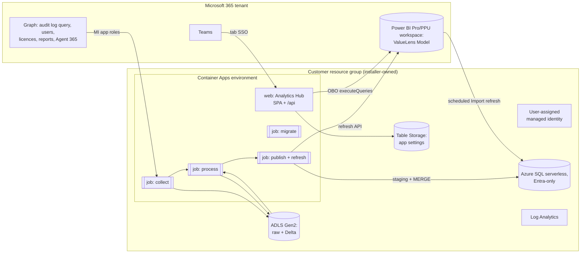

# Analytics Hub on Azure: a plan for running outside Fabric

## 0. Summary

This plan recreates Analytics Hub and its installer so they run in the **customer's own Azure
subscription** without Microsoft Fabric. The model is
[pnp/Microsoft365-Analytics-Insights](https://github.com/pnp/Microsoft365-Analytics-Insights): an
installer provisions PaaS, scheduled jobs collect data into SQL, and Power BI reports on it.
The **data, the semantic model and its measures, the app pages, the UX and the installer flow
stay the same**.

The recommended shape:

| Layer | Fabric today | Azure (recommended) |
|---|---|---|
| Collect and process | PySpark notebooks plus a Fabric pipeline | **Container Apps jobs** running the shared **DuckDB** core (`valuelens_core`, no Spark), scheduled by cron |
| Raw and curated storage | Lakehouse (Delta) | **ADLS Gen2** (raw and Delta) plus **Azure SQL Database serverless**, which holds the curated tables under the same names |
| Semantic model | ValueLens Model (Import from the SQL endpoint) on a Fabric capacity | **The same model**, Import from Azure SQL, in a **Power BI Pro or PPU workspace** |
| App data access | Fabric iframe bridge (`SemanticModelMessageClient`) | **`/api/query` proxy** calling Power BI `executeQueries` **on behalf of the signed-in user** |
| App settings store | Rayfin data (`CommercialTerms`, `TaskTime`) | `/api/settings`, backed by **Table Storage**, so SQL can stay paused |
| App hosting | Fabric App (AppBackend) | A **Container Apps web app** (or App Service / Static Web Apps), signed in with MSAL, plus a **Teams tab with SSO** |
| Identity | App registration plus a client secret in Key Vault (rotated every 12 months) | A **user-assigned managed identity** with Graph app roles for the collectors (**no secret**). The web app uses an app registration with a **federated credential** for on-behalf-of (OBO) |
| Installer | `valuelens-install`, Fabric target | **The same installer** with a second target, *Your Azure subscription*. Bicep (compiled to ARM) is deployed incrementally, and **ARM what-if** feeds the plan screen |

The MVP indicatively costs **about $10–40 a month** in Azure for a small tenant and about $60–150 for a large one.
A Fabric F2 costs about $263 on pay-as-you-go. On top of that, **viewers need Power BI Pro** (included in E5) or PPU
if the model is over 1 GB. Section 1.4 has the costs, and section 2 has the option to remove the licence requirement.

---

## 1. Lessons from PnP Microsoft365-Analytics-Insights

| Area | What PnP does | What we take or change |
|---|---|---|
| Installer | A .NET 4.8 WinForms exe (`App.ControlPanel`) with an encrypted JSON config. It fetches the latest release from the GitHub Releases API | **Take:** one exe that downloads release artefacts and saves its config. **Keep ours:** the Node installer with a browser wizard and plan/approve, which is already better UX |
| Provisioning | Azure SDK calls, one `InstallTask` per resource. Only Cognitive Services uses inline ARM. Repeat runs are safe, and **a SKU is set only when the resource is created** | **Change:** use declarative Bicep, so ARM **what-if** can power our plan screen and a *Deploy to Azure* or `azd` path comes for free. **Take:** preserve-on-update semantics for SKUs and scale settings |
| Resources | Windows App Service (B1/B2, Always On) hosts two continuous WebJobs and an ASP.NET portal. Also Azure SQL (Basic, or S2 for production), Storage, Key Vault (access policies), App Insights and Log Analytics, plus optional Redis, Service Bus, Automation and Text Analytics | **Change:** use scale-to-zero compute (Container Apps), not an Always On plan. Use SQL **serverless**. Use Key Vault **RBAC**. Leave out Redis, Service Bus and Automation |
| Identity | Two app registrations: the installer's SP (Owner on the resource group) and the runtime app (Graph application permissions, a secret or certificate in Key Vault, portal app roles `Portal.Administration` and `Portal.SeePII`) | **Change:** the runtime uses a **managed identity**, so there's no secret. **Take:** Entra app roles to gate the app (*Analytics Hub User*, *Analytics Hub Admin*), and nobody holds them by default |
| Collection | Continuous WebJob loops, a semicolon flag string `ImportJobSettings`, typed 429 `Retry-After` handling, and a bulk temp-staging table plus `MERGE` (`InsertBatch<T>`, 10k rows, capped concurrency) | **Take:** the staging-then-`MERGE` publish into SQL, the commit concurrency cap and the typed throttling. **Change:** triggered cron jobs, not continuous loops |
| Schema | EF6 code migrations, run by the installer re-invoking the downloaded binary (`--initdb`). Some migrations are documented as needing a maintenance window | **Take:** migrations run by the **same build** being deployed, and maintenance-window notes. **Change:** plain versioned SQL scripts run by a `migrate` job |
| Power BI | `.pbit` templates; the newer pattern publishes a model once and connects reports to it. Licences aren't included in their cost estimates | **Same as ours:** one model with measures, published to the service |
| Updates | No self-update. The operator re-runs the installer, which pulls the *latest stable* release. Stable and testing channels | **Take:** re-run to update, with channels. **Add:** an "update available" notice in the app, and an opt-in auto-update job later (Phase 4) |
| Known pitfalls | SQL public endpoint versus org policy; storage firewall; App Insights can't be private without AMPLS; Responsible AI terms gate; de-identified reports double users; Basic/S0 SQL can't pause; stopping an App Service doesn't stop billing | All of these go into the installer's **preflight** (section 4.4) |
| Cost | About €55–60 a month for a minimal PoC (B1 Windows plus SQL Basic). About €160–170 for production (B2 plus S2), excluding Redis and other options | Our target undercuts this by scaling to zero (section 1.4) |

---

## 2. Target Azure architecture

### 2.1 Recommended topology (MVP)



The job images come from public **GHCR** (`ghcr.io/microsoft/valuelens-*:<version>`), so no
container registry is needed in the customer's subscription.

### 2.2 Compute options (replacing notebooks and the pipeline)

| Option | Fit | Pros | Cons |
|---|---|---|---|
| **Container Apps jobs** (recommended) | Scheduled batch | Cron or manual triggers, scale to zero, long runs allowed, up to 4 vCPU / 8 GiB on consumption (more with dedicated profiles), managed identity, a free grant of 180k vCPU-seconds a month. The same environment hosts the web app. Avoids App Service regional quota | Needs a container image (we publish it). Region availability of the environment and a small extra quota to check |
| Azure Functions (Flex Consumption, Python) | Event or timer | Cheap and familiar | Memory per instance is limited; long audit backfills need Durable Functions; the host storage wants keys unless identity-based storage is configured (often blocked by policy) |
| App Service WebJobs (the PnP way) | Continuous loops | Proven in PnP | An Always On plan costs money even when idle; App Service quota is often 0 in MSCAPS regions |
| Synapse Spark, Databricks or HDInsight | Spark at scale | Runs the notebooks almost unchanged | Expensive and heavy; defeats the purpose |

**Orchestration.** A single `valuelens-jobs` image has an entry point like
`valuelens run --steps collect,process,publish,refresh`. It reproduces the step order and the `Enable*` switches of
`CopilotAdoptionPipeline` (`1. Fabric/Manual setup/pipelines/.../pipeline-content.json`). The image is
python:3.12-slim plus DuckDB: no JVM, a few hundred MB, and 2–4 GiB is enough for the daily run (DuckDB
spills to disk for a large backfill). The bottleneck is Purview audit API throttling, not compute. The ingesters run
in parallel within the process, then the processor, then publish, then the model refresh. The installer's
`run` command starts the job execution through ARM.

### 2.3 Storage options (replacing the Lakehouse)

| Option | Power BI fit | Cost | Verdict |
|---|---|---|---|
| **Azure SQL Database serverless** (General Purpose, 0.5–2 vCore, auto-pause) plus **ADLS** for raw and Delta | **Best.** The model already imports over TDS from the Fabric SQL endpoint (`FabricTable(...)` → `Sql.Database`), so only the source expression changes. Incremental refresh still folds | Free offer: 100k vCore-seconds and 32 GB a month. Otherwise about $5–80 a month depending on active hours | **Recommended** |
| Azure SQL provisioned (Basic/S0/S2, PnP-style) | Same | $5–75 a month, never pauses. Basic or S0 is too small for large `MERGE`s | A fallback where serverless isn't allowed |
| Postgres Flexible Server (B1ms) | Works through the Npgsql connector, but the model's queries and incremental-refresh folding need re-testing | About $15–25 a month | No advantage |
| ADLS only (Delta/Parquet), with Power BI's `DeltaLake.Table` | No query folding, so incremental refresh reads everything. Credential options are weaker | About $2–5 a month | Only for the Power BI-free route (2.4 C), with DuckDB in the API |

**Keep SQL quiet.** The app must not query SQL, because that would wake the serverless database.
App settings (`CommercialTerms`, `TaskTime`) go in Table Storage. SQL wakes only for publish and for
the Power BI refresh.

**SQL design.** Tables have the same names as the Lakehouse tables (`dbo.copilot_interactions_curated`,
`dbo.copilot_licensed_users`, `dbo.copilot_org_data`, `dbo.m365_activity_daily`, `dbo.agents_365`,
`dbo.user_feedback`, and the consumption and evaluator tables). This keeps the model's M expressions 1:1.
The large facts get **clustered columnstore**. Publishing uses a staging table plus `MERGE` by date partition,
as in PnP's `InsertBatch`. Authentication is **Entra-only**: the jobs use the MI, and Power BI uses the
reader SP (section 3.3).

### 2.4 Semantic model and query layer options

Today the app runs **101 DAX queries** (`1. Fabric/Fabric App/src/queries/**/*.dax`), wrapped by
`dax-filters.ts`, against a model with **19 tables and about 200 measures**
(`ValueLens - Fabric.pbit`, all Import). Rewriting them is the biggest risk in this project, so
the plan keeps DAX.

| Option | Viewer licensing | Effort | Parity | Cost |
|---|---|---|---|---|
| **A. Power BI Pro/PPU model + `executeQueries` via OBO proxy** (recommended) | Pro per viewer (E5 includes it). PPU if the model is over 1 GB | **Low.** The queries, filters and measures are reused as they are | Exact | $0 extra in Azure. Licences are often already owned |
| B. Same model, proxy calls as a service principal (app owns data) | Unlicensed viewers are only compliant if the model is on an embedding capacity (A or F SKU, about $260–735 a month). An SP can't query models with RLS | Low | Exact | High, and needs a capacity |
| C. Own API over SQL or DuckDB (app-side semantic layer) | No Power BI licence | **High.** About 200 measures and 101 queries become SQL or TypeScript, which creates a second source of truth for measures | At risk. Needs a DAX-versus-SQL parity harness | Lowest run cost |
| D. Azure Analysis Services | No Power BI licence for viewers (Entra users in an AAS role) | Medium. Power BI-only features (incremental refresh policies, field parameters) aren't supported, and it needs ADOMD in .NET | High | About $100–300+ a month; a legacy service |

**Recommendation:** A for the MVP. **C is optional in Phase 4** as a "Power BI-free" tier behind a
flag, only if customers ask for it. It would be validated query by query against A on the golden fixtures.

### 2.5 Indicative monthly cost (USD, pay-as-you-go list prices, one region; verify in the Azure pricing calculator)

| Item | Small tenant (≤5k users) | Large tenant (~50k users) |
|---|---|---|
| Container Apps jobs (daily, about 4 vCPU / 8 GiB) | $0–5 (inside the free grant) | $10–30 |
| Container Apps web app (min replicas 0; or 1 to avoid cold starts) | $0–15 | $10–20 |
| Azure SQL serverless GP (auto-pause, 32 GB) | $0–10 (free offer) | $30–80 |
| ADLS Gen2 + Table Storage | $1–5 | $5–15 |
| Log Analytics (5 GB a month free) | $0–5 | $5–15 |
| Key Vault (only if a secret is needed, section 3.3) | <$1 | <$1 |
| **Azure total** | **≈ $5–40** | **≈ $60–160** |
| Power BI | Pro $14 per viewer per month (in E5). PPU $24 if the model is over 1 GB | Same |
| *Compare: Fabric F2* | *≈ $263 pay-as-you-go (≈ $156 reserved)* | *F4–F8 and above* |

Variants: App Service B1 Linux for the web app (+$13), or B1 Windows as in PnP (+$55). SQL S0 provisioned
(+$15). Private networking (section 4.4) adds a gateway VM (about $30–70) and private endpoints
(about $7–8 each).

---

## 3. How the app gets data without the Fabric bridge

### 3.1 Code changes in the app (`1. Fabric/Fabric App`)

1. **Introduce a `DataHost` seam.** `getFabricClient()` (`src/lib/fabric-client.ts`) becomes
   `getQueryClient()`. It returns either the existing `FabricClient` (Fabric iframe) or an
   `HttpQueryClient` that POSTs `{ connection, query }` to `/api/query` and returns the same
   `CachedQueryResult` shape. `useSemanticModelQuery`, `useFilteredQuery`, `dax-filters.ts` and every query
   module stay as they are.
2. **Runtime config.** `runtime-config.ts` already reads `/fabric.config.json`. Add
   `/app.config.json` with
   `{ host: "azure", tenantId, clientId, apiScope, semanticModels: { alias: { workspaceId, datasetId } } }`.
   The host decides which client, auth and settings store to use. **One bundle** serves both hosts.
3. **Auth.** `use-auth.tsx` gets an MSAL (browser) implementation and a Teams implementation
   (`@microsoft/teams-js` `authentication.getAuthToken()`). `AuthGate` only redirects to Fabric when
   `host === "fabric"`.
4. **Settings store.** The Rayfin `CommercialTerms` and `TaskTime` (`rayfin/data/*.ts`) go behind a
   `SettingsStore` interface. On Fabric it's Rayfin; on Azure it's `/api/settings` (Table Storage,
   with writes limited to the *Analytics Hub Admin* app role).
5. **Links.** `fabric-item-url.ts` and the "open in Fabric" links become host-aware, so they go to the
   Power BI model on Azure.

### 3.2 The API (a small Node service in the same container as the SPA)

- `POST /api/query`: validates the user's JWT (audience `api://<host>/<clientId>`, the
  `Analytics Hub User` role). Then it gets a Power BI token **on behalf of the user** (delegated
  `Dataset.Read.All`) and calls `POST /v1.0/myorg/groups/{ws}/datasets/{id}/executeQueries`.
  - OBO means the user's own Power BI rights and any **RLS** apply. Arbitrary DAX from the client
    can't see more than the user can already see with Build.
  - The Power BI REST API isn't CORS-enabled, which is why the proxy is needed.
  - Limits: **120 queries per minute per user**, 100k rows or 1M values per query. Mitigations: a per-user LRU cache
    keyed by the model's last refresh time, request coalescing, and a concurrency limit per user.
    Phase 0 measures how many queries each page sends.
- `GET/PUT /api/settings`, `GET /api/version` (powers the "update available" notice) and `GET /api/health`.
- **OBO without a secret.** The web app registration gets a **federated identity credential** that trusts
  the user-assigned MI, so the container signs its client assertion with the MI. If a tenant blocks
  that, the fallback is a certificate in Key Vault.

### 3.3 Identities

| Identity | Kind | Permissions | Secret? |
|---|---|---|---|
| `id-valuelens-collector` | User-assigned MI | Graph app roles assigned to the MI's SP: `AuditLogsQuery.Read.All`, `Reports.Read.All`, `User.Read.All`, plus module extras. Azure: Storage Blob/Table Data Contributor, SQL `db_owner` through Entra, Cost Management Reader and Monitoring Reader (consumption), Power BI workspace Member (refresh) | **No** |
| `Analytics Hub` web app | App registration (SPA + API) | Exposes `access_as_user`; app roles *User* and *Admin*; delegated Power BI `Dataset.Read.All`; Teams client IDs pre-authorised | No (federated credential) |
| `Analytics Hub SQL Reader` | App registration (SP) | `db_datareader` in SQL; used as the Power BI data source credential for the scheduled refresh | **Yes** (certificate or secret in Key Vault). The installer rotates it, and `status` warns 30 days before expiry, as today |
| Agent Evaluator | MI or app registration | Dataverse application user with *Bot Transcript Viewer* | Verify whether Dataverse accepts an MI as an application user; otherwise an app registration with a certificate |

---

## 4. Porting the PySpark logic and keeping one source of truth

### 4.1 What there is to port

| Notebook (`1. Fabric/Manual setup/notebooks`) | What it does | Azure notes |
|---|---|---|
| `Copilot_Audit_Log_Direct_Ingester` | Runs Graph audit log queries (create, poll, page) with retries and a backfill or incremental mode | Pure Python plus Spark writes. Easy to port |
| `Copilot_Audit_Log_Processor` | **The core**: about 300 `F.` calls, windows and Delta `MERGE` into `copilot_interactions_curated` | The hard part |
| `Licensed_Users`, `Org_Data`, `M365_Activity`, `Agent365_Registry/Lander`, `ProductFeedback` | API pulls or CSV landings into snapshot tables | Easy |
| `credit-consumption/*` | Cost Management, Studio CSVs, Viva, GitHub, commercial terms | The Viva input uses a **Dataflow Gen2**, which doesn't exist outside Fabric. Replace it with a CSV upload to `landing/viva` (already supported) |
| `agent-evaluator/Copilot_Agent_Transcript_Parser` | Dataverse transcripts, about 96 KB of parsing logic | Medium |
| `ValueLens_Refresh_Model`, `ValueLens_Data_Check` | Refresh and checks | Becomes the `refresh` and `check` steps |
| `flows/Copilot_ProductFeedback_Email_to_OneLake` | A Power Automate flow that writes to OneLake | A variant that writes to the **Blob** connector instead |

The logic is **already forked**. `4. Local CSV/scripts/Purview_CopilotInteraction_Processor_v4.0.0.py`
(which PAX now embeds as `-Dashboard AIBV`) and the Dataverse bridge
(`2. Power Automate + Dataverse/scripts/Build-DataverseCoreFeeds.py`) both re-implement parts of the
Spark processor. The Azure version must not add a fourth copy.

### 4.2 Strategy: a shared DuckDB core, held to the notebooks by a parity harness

*Revised after review: Spark isn't needed for extraction or processing at ValueLens volumes (about 100k
interactions a day even for tenants of 5k+ users), so the MVP runs DuckDB rather than Spark-in-a-box.*

**Phase 0 (done for the processor): parity harness.** `tests/fixtures/valuelens-golden/` has synthetic
inputs (modern and legacy audit shapes, licences, the agent registry, missing dimensions, no `Id`, and empty)
and **expected outputs generated by running the Fabric notebook in local PySpark**
(`python tests/valuelens_golden.py --regenerate`). `tests/test_valuelens_core_parity.py` runs in CI and
fails on any difference in column order, types or rows. A live check regenerates from the notebook when
pyspark and Java are available.

**Phase 1 (MVP): `valuelens_core` on DuckDB.** `shared/python/valuelens_core` is a DuckDB port of
`Copilot_Audit_Log_Processor` cells 3–14 (`curate()`), and it matches all 7 golden cases exactly. The Azure
job image installs it. The ingesters and snapshot notebooks are plain Python (HTTP plus table writes), and
they're ported the same way, each with a golden case.
- **The notebook stays the source of truth** until Phase 3. A notebook change needs the same change in
  `valuelens_core` and regenerated goldens, or CI fails.
- A `publish` step loads the curated Parquet into SQL through a staging table plus a partition swap.
- Known engine difference: Spark `from_json` tolerates trailing garbage after valid JSON; DuckDB doesn't.
  It isn't seen in real audit records, and a fixture should be added if it is.

**Phase 3: a single core everywhere.** The Fabric notebooks become thin wrappers over `valuelens_core`
(Fabric Python notebooks with DuckDB; the installer inlines the package, as it already patches notebooks),
and the Local CSV and SharePoint processor (`Purview_CopilotInteraction_Processor_v4.0.0.py`) adopts it, with
an offer to upstream it to PAX. At that point the package, not the notebook, becomes the source of truth.
Why DuckDB: one engine runs everywhere, single-node scale reaches hundreds of millions of rows, and the SQL
is readable for reviewers.
---

## 5. Installer changes (`1. Fabric/installer`)

### 5.1 Flow (unchanged UX, new first question)

0. **Where should Analytics Hub run?** *Microsoft Fabric* | *Your Azure subscription*.
1. What to collect: the same `MODULES` in `catalog.js`. Each module also declares its Azure needs (MI app
   roles, storage containers, SQL tables, and a job step).
2. Power BI: the model and the app (default), the model only, or neither. On Azure, also **workspace**:
   create or pick one, and Pro or PPU.
3. Audit history: 30, 90 or 180 days.
4. **Azure:** subscription, region, resource group (create one, the default, or pick one), name prefix,
   extra tags required by policy, and networking (public, the default, or private, section 5.4).
5. App registration: create one or use your own (web app; and SQL reader).
6. Schedule: daily or weekly, with a time.
7. Run the first load now?
8. **Plan.** It shows ARM **what-if** (create, modify, no change) for the Azure resources, plus the Graph,
   Power BI and Teams actions. Nothing happens until it's approved.

`run`, `check`, `refresh`, `status`, `update`, `deploy-app`, `rotate-secret` and `preview` work on both
targets. `valuelens-install.json` gains
`target: "azure"` and an `azure` block: the subscription, the resource group, and whether the installer created it.
It also records each resource's ID with `created: true`, the image tag, the SQL server and database, the Power BI
workspace, dataset and refresh schedule, the web URL and app ID, the MI, and the Teams package path.

### 5.2 Provisioning mechanics

- **Bicep modules** live in `5. Azure/infra/` and are compiled to ARM JSON in CI. The JSON ships inside the exe.
  The installer deploys them at resource-group scope in **incremental** mode through ARM REST
  (it extends `clients/azure.js`, and the user's sign-in already includes ARM).
  The same templates support a *Deploy to Azure* button and `azd up` for IT teams that prefer IaC.
- **Never touch what it didn't create.** Every resource is tagged `valuelens-install-id=<guid>`. Before
  deploying, the installer checks each target name: if it exists without our tag, the installer picks the next
  free name (`-2`), as in Fabric today. The plan shows the final names. **Preserve-on-update**: the current SKU
  and scale are read back and passed in as parameters, so a customer's scale changes survive updates, as in PnP.
- Entra, Graph app roles and Power BI are handled by the existing `steps/identity.js` and `clients/powerbi.js`,
  extended for MI app-role assignments, federated credentials and Power BI workspaces.
- **Model deployment to a Pro workspace.** This needs a Phase 0 spike: do the Fabric REST semantic model
  definition APIs (which `steps/model.js` uses today) work in a **non-capacity** workspace?
  If not, CI builds a `.pbix` from the `.pbit`, the installer imports it with the Power BI Imports API
  (which works on Pro), then sets the parameters (`UpdateParameters`), binds the SQL reader credential, and
  sets the refresh schedule. `transform/model.js` gets a source mode: `FabricTable(...)` or `SqlTable(...)`.
- **Uninstall.** If the installer created the resource group, it deletes it. Otherwise it deletes only the
  recorded and tagged items. Resources that policies created (diagnostic settings, Defender) are listed and left alone.

### 5.3 Permissions the installing user needs

| Need | Why |
|---|---|
| Contributor **and** User Access Administrator (or Owner) on the subscription or resource group | To create resources and the MI's role assignments |
| Register apps (the default user setting) or Application Administrator | For the web app and SQL reader registrations |
| Privileged Role Administrator or Global Administrator (or send them a link) | To assign Graph app roles to the MI (equivalent to admin consent today) |
| Power BI Pro (or PPU) licence, and the ability to create workspaces | For the model workspace |
| Power BI tenant settings: *Dataset Execute Queries REST API*, and *Service principals can use Fabric/Power BI APIs* (for MI refresh) | The installer checks them if the user is a Fabric administrator |
| Teams: permission to upload custom apps, or an admin to approve | For the tab |

### 5.4 Quota and policy preflight (MSCAPS lessons)

Before showing the plan, the installer runs these checks and offers a fix for each.
| Pitfall | Detection | Remedy offered |
|---|---|---|
| **SQL public network access denied by policy** (common in MSCAPS) | ARM `validate` returns `RequestDisallowedByPolicy`, and a policy assignment scan | (a) Ask for an exemption on the resource group; or (b) **private mode**: a private endpoint, VNet-integrated Container Apps, and an **on-premises data gateway VM** for the Power BI refresh. A VNet data gateway needs a Fabric capacity, so it isn't available on Pro. We write the gateway step-by-step guide; it adds about $30–70 a month |
| Entra-only authentication required on SQL | Policy scan | Already the design (no SQL logins) |
| Storage `allowSharedKeyAccess=false` | Policy scan | Already the design (Entra RBAC only). Container Apps don't need keys |
| **App Service quota of 0 in a region** | Usages API | Already avoided (Container Apps). If the customer chooses App Service, show regions where it has quota |
| Container Apps environment or SQL serverless not available or out of quota in a region | `Microsoft.App` usages, SQL `capabilities` API | Suggest the nearest region that has it |
| Allowed locations or required tags | Policy scan | The region picker filters, and the wizard asks for the required tags |
| Resource providers not registered | `providers` API | Register them (Contributor can) |
| A Key Vault name is held by a soft-deleted vault | `checkNameAvailability` and deleted vaults | Offer to recover it (if ours) or take the next free name |
| Defender or diagnostic DINE policies | Policy scan | Note the extra cost and the resources we don't own |
| Model is over 1 GB on Pro | `check` reads the dataset size | Advise PPU or shorter audit history |

### 5.5 Updates

- **Releases.** One GitHub release carries the exe, the GHCR image tags
  (`valuelens-jobs`, `valuelens-web`, both immutable `X.Y.Z`), the ARM JSON, the `.pbix`/`.pbit` and the SQL migrations.
  There are stable and preview channels.
- **`update`** reads the record and fetches the newest release. It shows what-if plus a summary of the model and
  schema changes. After approval it runs the **`migrate` job** (versioned `V###__*.sql` scripts and a `schema_version`
  table, run by the same image version, as PnP does), then updates the image tags, the model and the web app.
  Any migration that needs a maintenance window pauses the schedule first.
- **In the app:** `/api/version` compares against the latest release and shows an "Update available" notice to admins.
- **Phase 4 (opt-in):** a weekly `updater` job that applies **patch** releases on the stable channel. It needs the MI
  to have Contributor on the resource group, so it's off by default.

---

## 6. Hosting the app and Teams

| Option | Pros | Cons | Verdict |
|---|---|---|---|
| **Container Apps web app** (same environment as the jobs, one Node container with the SPA and `/api`) | Scale to zero, MI-native, no App Service quota, one deployment model | 5–10 s cold start with min replicas 0 (use 1 for about $10–15 a month) | **Recommended** |
| App Service (B1 Linux) | Familiar; Easy Auth | Regional quota failures; Always On costs money | Fallback |
| Static Web Apps Standard + a linked backend (Container App or Functions) | A global CDN for the SPA | SWA managed functions can't use MI, so a linked backend is needed anyway; two resources; $9 a month | Optional |

**Teams tab with SSO.** This is a capability the Fabric item can't offer, because it can't sign in inside Teams.
- The installer generates `AnalyticsHub-Teams.zip` (manifest v1.17+, a static personal tab plus a configurable
  channel tab). `webApplicationInfo` holds the app ID and `api://<fqdn>/<clientId>`, and `validDomains` holds the
  Container Apps FQDN or a custom domain.
- On the app registration, the installer sets the identifier URI `api://<fqdn>/<clientId>` and pre-authorises the
  Teams clients `1fec8e78-bce4-4aaf-ab1b-5451cc387264` (desktop and mobile) and
  `5e3ce6c0-2b1f-4285-8d4b-75ee78787346` (web). It adds the Microsoft 365 app and Outlook client IDs if the app
  should also run there.
- In the app, `getAuthToken()` gets the token for our API, and the server does the OBO to Power BI. With
  consent and MFA prompts, it falls back to `authentication.authenticate()` in a pop-up.
- The CSP `frame-ancestors` allows `teams.microsoft.com`, `*.teams.microsoft.com` and `*.cloud.microsoft`.
- Sharing works through the **Analytics Hub User** app role (assign a group), plus Build on the model.
  The installer offers to grant both to one group.

---

## 7. Phased roadmap

| Phase | Scope | Exit criteria |
|---|---|---|
| **0. Foundations and spikes** (all shared) | The golden fixtures and parity harness. The `DataHost`, `QueryClient` and `SettingsStore` seams in the app, with no change on Fabric. The model template source switch. The installer `target` scaffolding. **Spikes:** (a) the Fabric REST model API on a Pro workspace versus `.pbix` import; (b) `executeQueries` OBO latency and the query count per page against the 120/min limit; (c) DuckDB memory and spill on a large-tenant 180-day backfill; (d) MI with Graph `AuditLogsQuery`; (e) MI calling the Power BI refresh API; (f) a federated credential for OBO | Each spike has a recorded go/no-go. The Fabric build is unchanged (existing tests pass) |
| **1. MVP: Azure Core** | Modules: core, org data and M365 activity. Resources: resource group, MI, ADLS, Log Analytics, the Container Apps environment and jobs, SQL serverless, and the web app. The Power BI workspace, model and refresh. MSAL sign-in and the `/api/query` proxy. The installer's Azure path with what-if, `run`, `status` and `update` | On one tenant, **all 101 queries return identical results** on Fabric and on Azure. A repeat run makes no changes. Resources the installer didn't create are never changed |
| **2. Parity and Teams** | The Teams tab with SSO. Modules: Agent 365, product feedback (Blob flow), credit consumption (Viva and Studio by CSV), Agent Evaluator, and Workday. Private mode with the gateway guide. Custom domain. `rotate-secret` for the SQL reader | The feature list matches Fabric 0.2.x |
| **3. Shared core** | Fabric notebooks and Local CSV adopt `valuelens_core` (the package becomes the source of truth); an offer to upstream it to PAX | The parity harness is green across all variants |
| **4. Optional** | A Power BI-free query layer (2.4 C) behind a flag; an opt-in auto-update job; an `azd` template or Marketplace listing | Driven by demand |

### What stays shared with Fabric

The `.pbit` model, its measures and its methodology; the 101 DAX queries, the filter layer and all the UI;
the installer wizard, plan, record and Graph identity steps; the module catalogue; `docs/METHODOLOGY.md`,
`docs/DATA-DICTIONARY.md` and `docs/PERMISSIONS.md` (which gain an Azure column); and the processing logic
(`valuelens_core` on Azure now, held to the notebooks by the parity harness; everywhere from Phase 3).

### Proposed repo layout

```
1. Fabric/            unchanged (app and installer stay here until Phase 3, then move to /app and /installer)
5. Azure/
  infra/              Bicep modules -> ARM JSON (CI)
  jobs/               Dockerfile, valuelens_jobs orchestrator (collect, process, publish, refresh)
  web/                Node API server (query proxy, settings, version) + Dockerfile (serves the app's dist)
  sql/migrations/     V001__init.sql …
  teams/              manifest template, icons
  README.md
shared/python/valuelens_core/   DuckDB port of the processor (exists)
tests/fixtures/valuelens-golden/
```

---

## 8. Risks

| Risk | Impact | Mitigation |
|---|---|---|
| Viewers need Power BI Pro or PPU | Adoption cost for E3 tenants | The same as Fabric below F64. Document it clearly. Phase 4 adds the Power BI-free option |
| Model over 1 GB on Pro | Refresh fails | `check` warns; offer PPU or shorter history; trim columns, as the template already does |
| `executeQueries` throttling (120/min/user) or the tenant setting is off | Pages load slowly or fail | Measure in Phase 0; cache, coalesce and limit concurrency; the installer checks the tenant setting |
| DuckDB runs out of memory on a very large backfill | Backfill fails | Set `memory_limit` and a temp directory so it spills to disk; process the backfill in date chunks; use a larger workload profile for the backfill only |
| Logic drifts between Fabric and Azure | Different numbers | Notebooks stay the source until Phase 3; Spark-generated goldens and the parity test run in CI; the release is blocked if they fail |
| SQL public access is blocked by policy | The Power BI refresh can't reach SQL | Preflight; an exemption; or private mode with a gateway VM |
| One secret remains (the Power BI → SQL credential) | Expiry outages | A certificate with installer-managed rotation; `status` warns 30 days before |
| MI support gaps (Dataverse application user, Power BI API) | Some modules need app registrations | Spike in Phase 0; fall back to certificate-based app registrations |
| Two targets double the support and test matrix | Slower releases | A nightly CI deployment to a test subscription (Fabric and Azure) running the parity check; shared code paths |
| Teams SSO: identifier URI and domain constraints, and custom app policy | The tab doesn't sign in | The installer sets the URI after the FQDN is known; the admin approval guide |

## 9. Open decisions for review

1. Is per-viewer Power BI Pro acceptable for the MVP (option A), or is a Power BI-free tier (C) required from the start?
2. ~~Spark-in-a-box or DuckDB for the MVP?~~ **Resolved: DuckDB.** The processor port is done and matches the notebook (section 4.2).
3. Should private networking be in Phase 2 or the MVP (how many target customers have SQL public-access deny policies)?
4. Repo layout: is a new `5. Azure/` folder OK, and should the app and installer move out of `1. Fabric/` in Phase 3?

## 10. Progress

| Item | Where | State |
|---|---|---|
| Golden fixtures, Spark-generated expected outputs, parity harness | `tests/valuelens_golden.py`, `tests/fixtures/valuelens-golden/` | Done: 7 cases |
| DuckDB processor port (`curate()`) plus CLI | `shared/python/valuelens_core` | Done: matches the notebook exactly; tested in CI |
| Bicep: MI, monitoring, ADLS, SQL serverless, Container Apps env, jobs, web | `5. Azure/infra` | Done: builds and lints cleanly; what-if is not yet run against a subscription |
| SQL `V001` (curated fact, columnstore, schema_version) | `5. Azure/sql/migrations` | Done: checked against the golden contract in tests |
| Jobs image and orchestrator | `5. Azure/jobs` | `process` works on local or mounted data; collect, publish, refresh and migrate are Phase 1 |
| Web API, Teams manifest, app seams, installer Azure target | `5. Azure/web`, `5. Azure/teams`, `1. Fabric/...` | Not started (READMEs describe the design) |